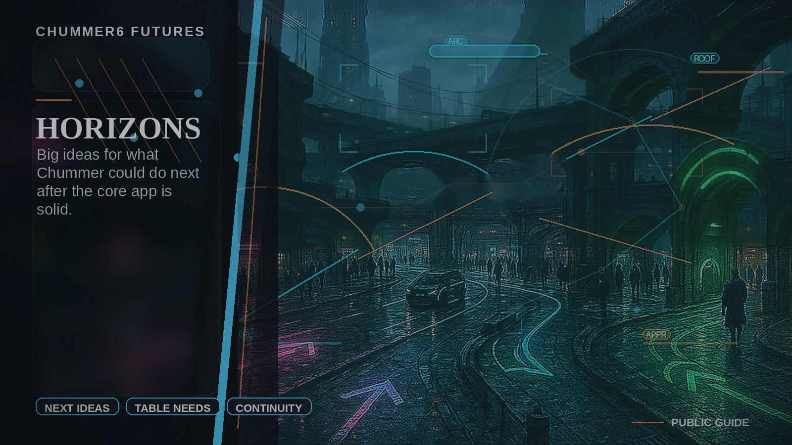

# Horizons

Welcome to the garage. Step out of the rain and see what is flickering on the holographic workbench.

This is where we track street intel on the next generation of shadow-tech. We are looking at deeper simulation energy—fully scripted gear-logic and dossiers that carry the weight of a briefcase full of nuyen. These are not just software updates; they are blueprints for a deterministic runner ecosystem where every script hook is a tool and every rule era is respected. It is experimental, ambitious, and currently being hammered out in the dark corners of the grid.

> **Reality check from the troll behind the curtain**
> These are horizon ideas, not signed blood contracts. Some may ship. Some may mutate. Some may remain beautiful nonsense forever.
> If your table pain is different, pitch a better future. Later there should be a better way for chummers to help signal which rabbit holes deserve the next flashlight.
>
> Also, if the dev says all of these are "basically done," check whether he also says "one tiny refactor" before setting a repo on fire.

## Pick the pain, then the codename

- **My table desyncs and devices go weird.** [NEXUS-PAN](nexus-pan.md)
- **We argue about why the math did that.** [RULE X-RAY](rule-x-ray.md)
- **We only find weak builds after they die.** [ALICE](alice.md)
- **We want house rules without fork chaos.** [KARMA FORGE](karma-forge.md)
- **We want dossiers and recaps without made-up nonsense.** [JACKPOINT](jackpoint.md)
- **We need to replay what actually happened after a run goes sideways.** [GHOSTWIRE](ghostwire.md)
- **We keep forgetting campaign consequences until the GM remembers them dramatically.** [HEAT WEB](heat-web.md)
- **We want honest migration between rule environments.** [RUN PASSPORT](run-passport.md)
- **Our clever mods keep trying to stab each other.** [THREADCUTTER](threadcutter.md)
- **We want to compare two futures before we commit to one.** [MIRRORSHARD](mirrorshard.md)
- **We need a brutal pre-run idiot check.** [BLACKBOX LOADOUT](blackbox-loadout.md)

## Other rabbit holes still on the shelf

- **We need controlled operator actions with receipts and undo.** [COMMAND CASKET](command-casket.md)
- **We want a grounded review room for explain and provenance.** [EVIDENCE ROOM](evidence-room.md)
- **We want continuity artifacts without fake authority.** [PERSONA ECHO](persona-echo.md)
- **We may eventually need a discovery lane for packs and artifacts.** [SHADOW MARKET](shadow-market.md)
- **We want shared situational awareness during live sessions.** [TACTICAL PULSE](tactical-pulse.md)

## What you get on each page

- the table pain
- a short scene so you can feel it
- what Chummer would be doing while the table keeps playing
- the payoff if it ever lands
- the reason it is still parked
- the foundations that have to exist first

## Pitch your own future

If your table pain is not on this list, good. Horizons is not holy scripture. Bring a better problem and a sharper idea.
---

_Last synced: 2026-03-13_ 
_Derived from: chummer6-design horizon guidance, current public shape_ 
_Canonical source: chummer6-design_
