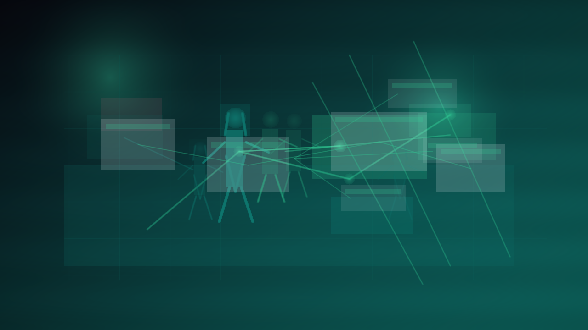
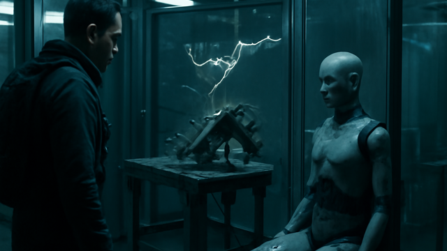

# ALICE

 _[simulation before regret.](../assets/horizons/alice.png)_

**Grounded what-if analysis before the bad build hits public view.**

_Status: Horizon only — future idea, not active build work._

## What problem does this solve?

It is cheaper to catch a weak build early than to apologize for it later.

## A real table scene

Player: I thought this build was clean.
GM: ALICE says the weak point shows up on turn two, not after the campaign starts.
Decker: Good. I would rather get roasted by a preflight than by the whole table.
Chummer6: The hallway goes loud, your soak folds, and the plan stops being clever.
Player: Show me the evidence, not the vibes.
GM: Exactly. Humiliation is cheaper in preview.

## Meanwhile, Chummer is doing this

- Comparative analysis has to stay tied to visible proof instead of fuzzy assistant theater
- Preflight checks only matter if they are explainable enough for a skeptical table

## Why that would be great

It could catch weak assumptions before they become public embarrassment or campaign drag.

## Why it is still a Horizon

Advice that sounds clever but cannot show its work is worse than silence, so this stays hypothetical until the evidence holds.

## What would need to exist first

- D0
- D2
- E0

## Pitch your own future

Catch the weak build before the table has to.
---

Updated: 2026-03-21
