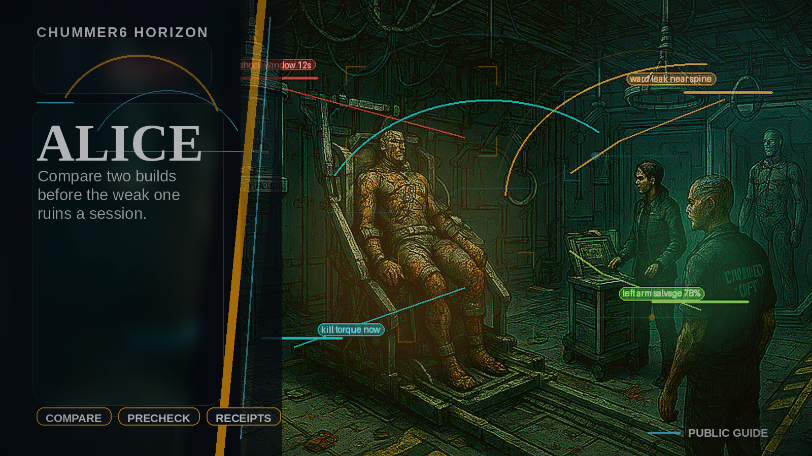

# ALICE

Builders get grounded what-if checks instead of vague AI advice.



## Why this matters

We only discover weak builds after they explode in public.

Picture the scene: A player compares two builds and sees the tradeoffs, the math, and the likely trouble spots before the session starts.


## Current stage

- Today: shipped native desktop workbench with origin-first chargen handoff.
- Next: `Origin Dossier Bundle` canon approval, portrait selection, dossier export, audiobook, scene render, and short dossier video.

**ALICE is Chummer’s build-simulation and what-if workbench: the desktop lane where players compare builds, catch trouble, test upgrade paths, ask rules questions, and understand tradeoffs before the table discovers the mistake under pressure.**

Many weak builds are not obvious at creation time.

A player thinks they built a decker.
The table discovers they cannot afford the gear that makes the role work.
A face has social dice but no survival path.
A combat build hits hard once and then collapses.
A table discovers their favorite option is now campaign-illegal.

ALICE exists so Chummer can say:

> “This is legal, but it may not do what you think.”

## The promise

**Grounded build advice without invented mechanics.**

ALICE should compare, simulate, and explain using Chummer-owned engine truth.

The current shipped slice already includes:

- native desktop build-help turns
- native desktop rules-coach turns
- native `Origin draft` turns
- persistent conversation history in the workbench
- bounded starter prompts
- `Start from Origin` wizard before normal chargen
- ALICE build translation from origin into a guided creation lane
- first-party handoff into account ALICE routes

The next design layer is:

**Origin Dossier Bundle = approved narrative canon plus derivative media, with ALICE translating canon into a grounded build path.**

It can help answer:

- Which build is stronger for this role?
- Which option gives the better tradeoff?
- What breaks if I switch campaigns?
- Which upgrade path makes sense?
- What is a role trap?
- What does campaign change?
- What is legal but fragile?
- What can I fix quickly?

But ALICE must never invent rules.

Every claim needs a receipt.

## What it feels like

A player compares two builds:

```text
Variant A: decker/infiltrator
Variant B: pure decker
```

ALICE says:

```text
Variant B is stronger for Matrix-first runs.
Variant A is safer for mixed social infiltration.

Tradeoffs:
- Variant B improves core Matrix capability.
- Variant A survives better outside the host.
- Variant B exceeds your campaign’s starting gear budget unless the GM approves a black-channel exception.
- Variant A leaves you weaker against heavy IC.

Recommended next question:
Are you joining a Matrix-heavy campaign or a mixed-op open run?
```

Buttons:

- Show math
- Show receipts
- Compare team role fit
- Fix budget issue
- Keep my chaos

That is ALICE.

## What it should include

### Origin Dossier Bundle

The premium narrative-first lane is not just “write a backstory.”

It is a two-stage product:

1. **Canon formation**
2. **Derivative rendering**

Canon formation produces the stable origin package that Chummer keeps as truth-adjacent continuity:

- approved origin summary
- approved full origin
- build implications
- contradiction flags
- approved portrait
- approved scene brief
- ALICE build translation
- GM-safe summary

Derivative rendering hangs off that approved canon:

- portrait set
- audiobook
- PDF dossier
- scene stills
- short dossier video

That separation matters. Media can regenerate. Approved canon should not drift silently.

### Build comparison

Compare:

- current build vs snapshot
- variant A vs variant B
- runner vs campaign rule environment
- runner vs team needs
- current build vs upgrade goal
- quickstart vs custom build

### Tradeoff briefs

Not just “better/worse.”

Show:

- what improves
- what worsens
- what becomes illegal
- what becomes expensive
- what becomes fragile
- what depends on campaign context
- what role the build actually fits

### Trap detection

Detect:

- archetype drift
- underfunded role
- missing required gear
- weak survivability
- illegal package conflict
- bad upgrade path
- duplicate team role
- campaign mismatch
- hidden dependency

### Upgrade path planning

Help users ask:

- what should I buy next?
- what is the cheapest meaningful upgrade?
- what becomes available after this run?
- what should I not buy yet?
- what does this faction/world offer unlock?

### Team analysis

For campaigns and open runs:

- role coverage
- unresolved role
- missing Matrix/magic/social/combat coverage
- build conflicts
- quickstart recommendations

### Origin-first chargen

The origin-first lane should feel like a modern successor to life modules:

1. `Start from Origin`
2. structured wizard choices
3. origin review
4. ALICE build translation
5. guided chargen handoff

Wizard inputs stay structured and short:

- background
- turning point
- training path
- pressure / cost
- upgrade exposure
- present motivation
- tone
- optional note

ALICE then offers:

- most grounded build
- stylized build
- stretch build

Each recommendation should show:

- likely metatype
- likely archetype
- likely build method
- likely quality posture
- likely augment / magic / matrix direction
- where the choice is grounded versus stretch

Nothing is auto-applied. The user still confirms real build choices in chargen.

### Portraits

Portrait generation should be constrained:

- 4 candidates max
- 1 selected canonical portrait
- optional regenerate

Too many portrait candidates make the surface feel cheap. The bundle should feel curated.

### Scenes

Do not render random action art.

First create a **scene brief**:

- setting
- mood
- framing
- visible augment / magic / matrix cues
- why the moment matters

Then render:

- 2-3 scene candidates
- 1 selected canonical scene

Best scene categories:

- turning point
- clinic / upgrade memory
- before the run
- street survival
- quiet character moment

### Audiobook

Two audio outputs are better than one:

- `Origin Reading`
- `Dossier Brief`

The first is atmospheric. The second is practical.

### PDF dossier

The PDF should be a real dossier, not just exported prose:

1. portrait
2. origin summary
3. full origin
4. build logic
5. hooks
6. contradictions
7. ALICE recommendation
8. GM-safe excerpt

### Video

The video should be short and structured:

- 45–75 seconds
- title card
- selected portrait
- selected scene
- narrated summary
- one build implication card
- close card

This is a dossier clip, not a trailer.

## What users want to know

### Is ALICE AI?

It may use assistant phrasing or drafting support, but mechanics come from Chummer-owned engine truth.

### Will ALICE tell me the “best” build?

It should explain tradeoffs, not erase player taste.

### Can it work with house rules?

Yes. It must understand the active rule environment and show what changed.

### Can it help with open runs?

Yes. It can show whether a runner fits a GM’s open-run joining policy.

### Can it be funny?

Yes. The companion can comment. The receipts still do the serious work.

## What it is not

ALICE is not:

- a hidden optimizer
- a build police bot
- an AI rules engine
- a powergaming-only tool
- legality by vibes
- advice without receipts

It should help users think, not replace them.

## The first slice

The first shipped ALICE slice is:

**Native build-help, rules-coach, and origin-to-build workbench**

It lets a user:

1. ask grounded build questions
2. ask grounded rules questions
3. start from an origin-first wizard before chargen
4. let ALICE translate that origin into a guided build lane
5. stay inside the native desktop workbench
6. inspect evidence and suggested next actions
7. keep per-mode conversation continuity
8. hand off into account ALICE when deeper follow-through is needed

Success looks like:

> A player stays inside the desktop, asks what to add next or what rule they are missing, and gets a bounded answer without being dumped into a vague public chat lane.

## Product rules

Hard guardrails:

- Chummer owns rules truth and build truth.
- ALICE suggests; it does not silently mutate the build.
- Portraits and scenes do not imply mechanics.
- Audiobook, PDF, and video are derivative outputs only.
- Canon approval must be explicit.
- Regenerating media must not overwrite approved canon silently.

## Suggested rollout

Phase 1:

1. origin wizard
2. origin review
3. ALICE build translation
4. canon approval
5. guided chargen handoff

Phase 2:

1. portrait set
2. PDF dossier

Phase 3:

1. audiobook
2. scene render
3. short dossier video

## The vision

Chummer should not only answer:

> “Is this legal?”

It should also answer:

> “Will this actually work for what I am trying to do?”

**ALICE is where Chummer becomes a build mentor with receipts.**
