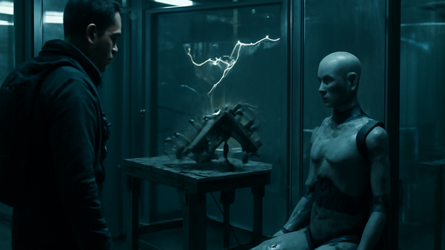

# ALICE

 _[simulation before regret.](../assets/horizons/alice.png)_

**Builders can branch the same runner into temporary build ghosts, compare grounded tradeoffs, and commit only the variant they trust.**

_Status: Horizon only — future idea, not active build work._

## What problem does this solve?

We only discover weak builds after they explode in public.

## A real table scene

The player is bragging. The sim bench is about to take that personally.

> **Player** 
> "My infiltrator is unstoppable."

> **GM** 
> "Last run you got flash-banged by a rent-a-cop and cried."

> **Player** 
> "That was tactical sorrow."

> **Chummer6** 
> "Ran 500 seeded breach sims. In 71 percent of them, you fold the moment the hallway goes loud."

> **Player** 
> "Rude."

> **Chummer6** 
> "Suggested fixes: stop treating Body as decorative."

## Meanwhile, Chummer is doing this

- replaying a seeded scenario with the same inputs
- holding the runtime stack constant between runs
- tracing the collapse point instead of just reporting failure
- showing which rule path, modifier, or choice killed the build

## Why that would be great

Builders can branch the same runner into temporary build ghosts, compare grounded tradeoffs, and commit only the variant they trust.

## Why it is still a Horizon

Because the engine and explain seams still need to become cleaner before simulation gets to wear a lab coat.
