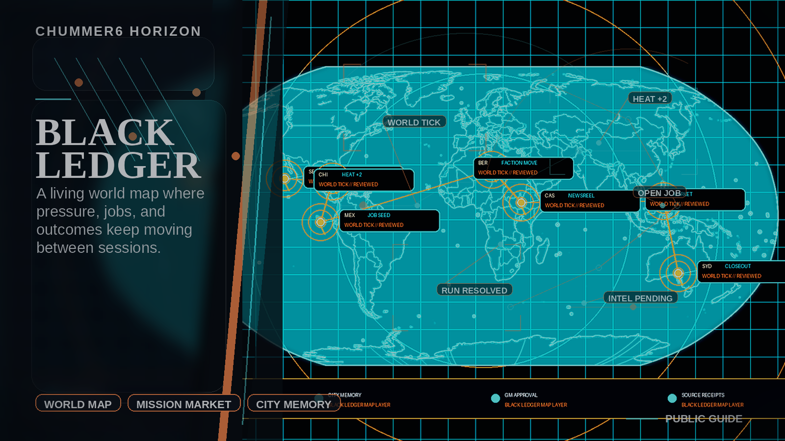

# BLACK LEDGER

**A governed city memory that turns finished runs into useful future pressure.**

_Status: Horizon only — future idea, not active build work._

## What problem does this solve?

Campaign worlds feel alive only if consequences survive the session without stealing authority from the GM.

## A real table scene

GM: The Redmond job is done, but the city should not forget it by next week.
Chummer6: Resolution report staged. District pressure rises, one faction project advances, one player-safe rumor is ready.
Player: Can the table see the fallout without seeing every spoiler?
Fixer: I want the next job to feel connected, not prewritten.
GM: Good. The map remembers, but I still approve what becomes true.
Chummer6: Consequence waits for GM signoff before the ledger talks back.

## Meanwhile, Chummer is doing this

- World memory only helps if GM approval, spoiler boundaries, and source trails stay clear
- Mission-market hooks have to improve prep without turning the campaign into an autonomous strategy game
- Player-safe city news must be useful without leaking private campaign truth

## Why that would be great

It could make campaigns feel connected across jobs by turning approved consequences into map pressure, prep hooks, faction motion, and player-safe news the table can actually use.

## Why it is still a Horizon

The layer has to prove authority boundaries, spoiler policy, and consequence receipts before it deserves to affect a living campaign.

## What would need to exist first

- C0
- C1
- D0
- D1
- D2
- E2b
- F1

## Pitch your own future

Let the city remember the run without letting the software become the GM.
---

Updated: 2026-04-25
