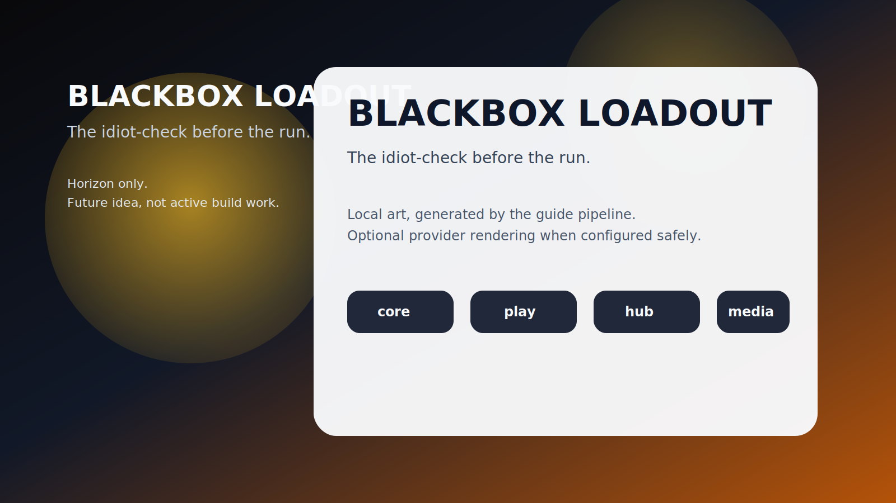

# BLACKBOX LOADOUT

**The idiot-check before the run.**

_Status: Horizon only — future idea, not active build work._

## The brutal truth

People do not die because they forgot courage. They die because they forgot ammo, rope, and basic self-respect.

## The use case

You hit run-ready, and the system points at the exact gear, resources, and prep holes most likely to get you folded in the first scene.

## What is the idea?

BLACKBOX LOADOUT is a future rabbit hole worth documenting because it solves a real problem in a way that could make Chummer feel sharper, weirder, and more alive.

## What problem does it solve?

Runner prep fails more often from missing essentials than from heroic intent.

## Foundations first

- runtime stack manifests
- compatibility checks
- preview receipts

## Which parts would it touch later?

- `play`
- `hub-registry`
- `design`

## Why it waits

Because the stack/loadout model still needs to exist before the repo can shame you with confidence.
---

_Last synced: 2026-03-11_  
_Derived from: chummer6-design horizon guidance, current public shape_  
_Canonical source: chummer6-design_
