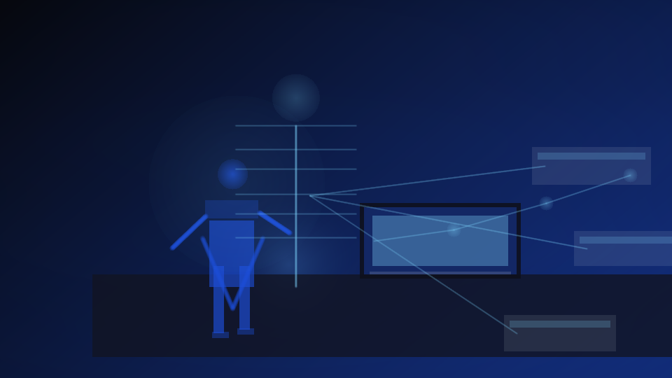

# BLACKBOX LOADOUT

 _[the software notices you forgot ammo before the NPCs do.](../assets/horizons/blackbox-loadout.png)_

**The software notices you forgot ammo before the NPCs do.**

_Status: Horizon only — future idea, not active build work._

## What problem does this solve?

People rarely die in the sprawl because they lacked courage. They die because they forgot rope, spare clips, and basic self-respect. Traditional sheets are just digital paper that lets you lie to yourself about your readiness until the first Initiative pass proves you're a walking corpse.

## A real table scene

GM: 'The HTR team is breaching. You grab your rifle... and?' Sam: 'And I slot the APDS clip!' Deck: 'Negative. You left the APDS in the locker. You have two clips of regular and a half-eaten stick of licorice.' Sam: 'I swear I dragged that into my active loadout!' GM: 'The blackbox says otherwise. Hope the licorice is armor-piercing.' Sam: 'Frag my life.' GM: 'Roll for it.'

## Meanwhile, Chummer is doing this

- Hardening the Lua-driven ruleset to ensure gear compatibility isn't just a suggestion. - Stress-testing the local-first provenance receipts so your gear stays yours even when the grid goes dark. - Refining the workbench UI to make 'missing essentials' glare at you in neon cyan.

## Why that would be great

It’s a cold, digital audit that refuses to let you be lazy. By linking runtime stack manifests directly to your active dossier, the system catches the compatibility errors and resource gaps that GMs usually find three seconds too late. It turns your inventory into a verified manifest, ensuring you have the right tools for the job before you leave the van.

## Why it is still a Horizon

We’re busy roasting the legacy math that makes gear tracking a chore. The engine needs to be deterministic before we add the 'nag' layer; otherwise, we’re just giving you buggy advice. We are perfecting the SR4 plugin contract and PWA offline reliability so your manifest is always the single source of truth, even in a dead zone.

## What would need to exist first

- runtime stack manifests
- compatibility checks
- preview receipts

## Pitch your own future

If you've got a better logic-gate for catching runner stupidity, the issue tracker is waiting for your telemetry.
---

Updated: 2026-03-13
