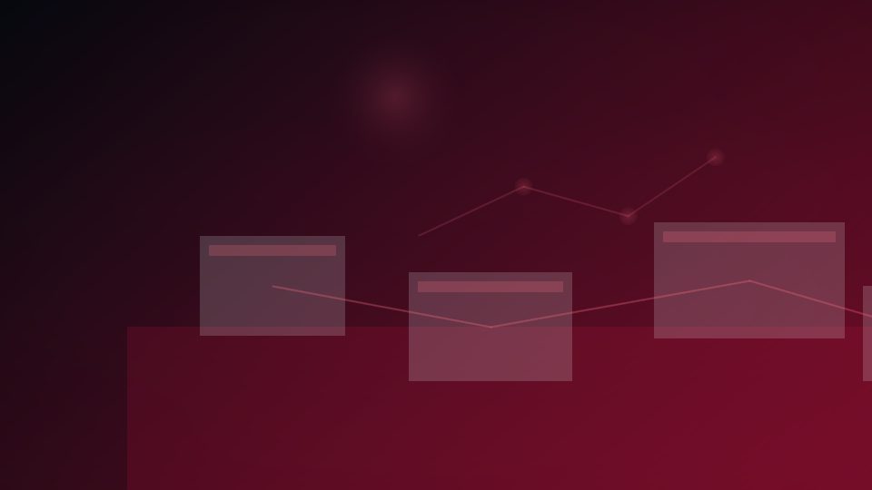

# Command Casket

 _[somebody definitely called this a tiny admin tweak right before it needed a coffin.](../assets/horizons/command-casket.png)_

**Stop praying to the ghosts in the machine; Command Casket wraps every high-stakes operator action in an auditable capsule with a hard-wired burial plan for errors.**

_Status: Horizon only — future idea, not active build work._

## What problem does this solve?

Important operator actions shouldn't dissolve into mystery-admin folklore. When your 'tiny tweak' crashes the host because you merged a half-baked script directly into the live grid without a single test, and nobody can find the undo button, you aren't running a system—you're just button-mashing in a haunted server room.

## A real table scene

GM: The host just rebooted, but all the maglocks are stuck on 'cycle' mode. Decker: I didn't touch the locks, I just patched the ICE protocols. Rigger: Someone definitely touched them. My drone is currently locked in the garage. GM: Check the casket. Who authorized the patch? Decker: Scanning... It says 'Operator 42' at 03:00. No rollback receipt found. GM: The Host starts venting knockout gas. Looks like 42 didn't have a burial plan.

## Meanwhile, Chummer is doing this

- Hardening the Lua-driven ruleset for deterministic math. - Refining the PWA offline experience for those deep-sublevel runs. - Building out the SR4 provenance logic for absolute rule transparency.

## Why that would be great

It turns 'trust me, I'm a decker' into a verifiable audit trail. By wrapping sensitive changes into capsules with requesters, approval states, and preview receipts all in one place, you get a digital seal of accountability. If a change goes south, you don't scramble—you execute the burial plan and trigger a rollback before the HTR teams even get the alarm.

## Why it is still a Horizon

Command Casket is a key part of the long-range plan, but right now the team is focused on mastering the SR4 ruleset and ensuring your local-first data stays static-proof. It requires deeper session shell integration to ensure an 'Undo' button actually works across different eras without corrupting your dossier or leaving the grid in a permanent state of reboot.

## What would need to exist first

- approval-aware workflows
- preview, apply, and rollback receipts
- auditable command capsules

## Pitch your own future

Think you’ve got a cleaner way to bury a bad admin call before it flatlines the team? Pitch your better burial plan on the tracker.
---

Updated: 2026-03-13
