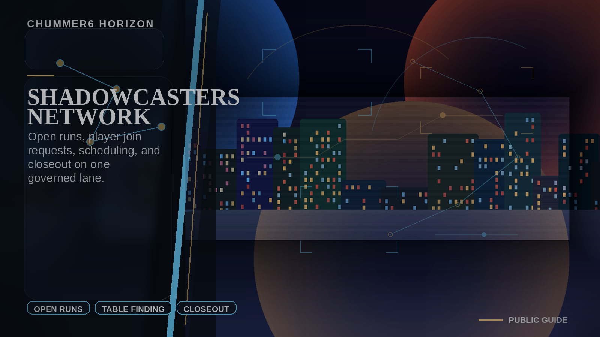
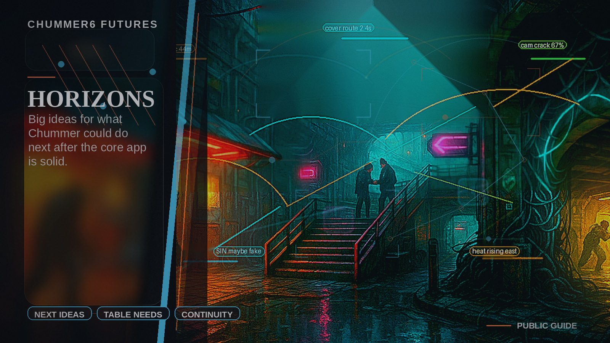

# COMMUNITY HUB

**A GM opens a run, Chummer preflights the right players and rule environment, gets the table scheduled, and the world remembers the outcome.**

_Status: Horizon only — future idea, not active build work._

## What problem does this solve?

Finding a table still means juggling community rules, approvals, chats, calendars, and follow-up by hand.

## A real table scene

A GM opens a run, Chummer preflights the right players and rule environment, gets the table scheduled, and the world remembers the outcome.

## Why that would be great

A GM opens a run, Chummer preflights the right players and rule environment, gets the table scheduled, and the world remembers the outcome.

## Why it is still a Horizon

It stays parked until the current product can prove the basics well enough.
