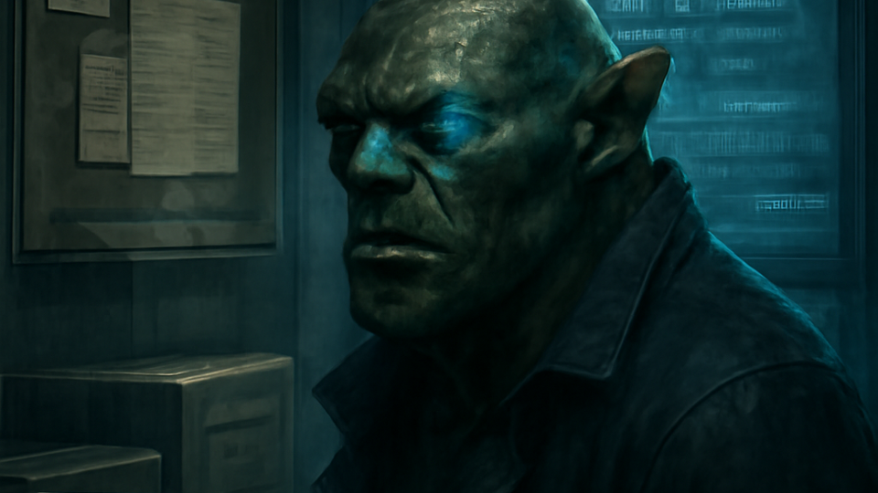
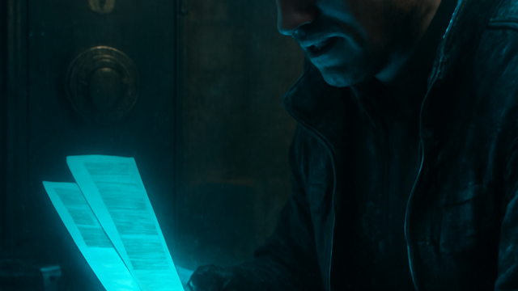

# Evidence Room

 _[proof, provenance, and one coffee cup that has seen too much.](../assets/horizons/evidence-room.png)_

**Forensic math for the paranoid professional.**

_Status: Horizon only — future idea, not active build work._

## What problem does this solve?

The era of 'vibe-based' math is over. Right now, if a modifier feels wrong, you’re stuck excavating raw Lua logs like a digital archaeologist because some dev decided that 'readability' was a secondary concern to their clever one-liners. Most tools treat calculations like a black box—you get a number, you pray the dev actually read the errata, and you move on while the GM eyes your dice pool with deep suspicion.

## A real table scene

GM: 'Wait, why is your recoil compensation so high?' Player: 'Opening the Evidence Room... scanning the grid.' GM: 'I see three different armor mods stacking.' Player: 'The receipt shows the internal gas-vent system and the gyro-mount.' GM: 'But where is the third?' Player: 'Ah, a leftover Lua trace from that homebrew street-doc. It’s marked as -Unapproved-.' GM: 'Delete the ghost mod. Roll the real dice.'

## Meanwhile, Chummer is doing this

- Hardening the deterministic Lua engine to ensure the math never hallucinates. - Polishing the SR4 plugin to handle multi-era modifier stacking without 'ghost' digits. - Optimizing explain-receipt data structures for high-speed mobile rendering.

## Why that would be great

It turns the 'because I said so' argument into a verifiable paper trail. By separating 'preview' from 'apply' and tagging every digit with its source-book provenance, the Evidence Room provides a tactical HUD for your character data. You get the cold comfort of absolute mathematical certainty without the headache of digging through raw developer-tier trace noise.

## Why it is still a Horizon

Designing a UI that doesn't look like a 1998 spreadsheet while handling deep-sim rule traces is a delicate operation. We're prioritizing core engine stability and Lua ruleset portability first—because a pretty UI for broken math is just a polished lie. Until the engine can reliably 'explain' its work to a human without killing the table's momentum, this node stays on the horizon.

## What would need to exist first

- evidence receipts
- source classification
- approvals
- preview and apply separation

## Pitch your own future

If you've got a sharper vision for forensic data-viz, the design tracker is waiting for your signal.
---

_Last synced: 2026-03-13_ 
_Derived from: chummer6-design horizon guidance, current public shape_ 
_Canonical source: chummer6-design_
