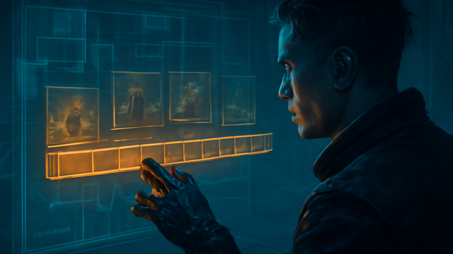

# GHOSTWIRE

 _[memory is a liar; event logs are just meaner about it.](../assets/horizons/ghostwire.png)_

**Memory is a liar; event logs are just meaner about it.**

_Status: Horizon only — future idea, not active build work._

## What problem does this solve?

After a four-hour crawl through a Renraku black-site, every runner becomes a professional liar. The Decker swears the silent alarm was a glitch, the Street Sam claims they stayed in cover, and the Mage is 'pretty sure' they didn't take drain. Without a hard record, the session devolves into a memory contest with worse lighting and higher stakes than the actual run.

## A real table scene

GM: 'HTR is five minutes out. Who left the side door unslaved?' Decker: 'Wasn't me. I had a clean loop on the sensors.' Street Sam: 'I was suppression-firing the lobby. Check the logs.' Adept: 'I was invisible. Physics says I'm innocent.' GM: 'Opening GHOSTWIRE. Scrubbing back three minutes.' *HUD flicker: Event [Sensor_Trip] triggered by [User_Adept] at 02:44.* GM: 'Looks like your invisibility didn't cover the pressure plate, omae.' Adept: 'Frag.'

## Meanwhile, Chummer is doing this

- Engineering the provenance engine to stamp every Lua-trigger with a forensic hash. - Refining the event-scrubbing UI so you can jump between combat phases like a trid-editor. - Stress-testing the sync seams to ensure the local truth matches the table reality.

## Why that would be great

GHOSTWIRE turns 'he-said, she-said' into 'the-logs-said.' It provides a deterministic playback of every state change, dice roll, and rule trigger in your session. By treating the run as a forensic simulation, you get replayable receipts that settle disputes before they turn into table-flipping arguments. It’s the black box flight recorder for your team’s most disastrous decisions.

## Why it is still a Horizon

Because building a time machine for bad math is harder than it looks. We’re still hardening the core engine to ensure that recording a session doesn’t melt your mobile processor or desync your team’s dossiers mid-firefight. We're busy ripping out the 'trust me' logic and replacing it with deterministic scripts that actually survive a forensic audit.

## What would need to exist first

- session authority and event history
- evidence labeling
- replayable receipts
- clean sync seams

## Pitch your own future

Help us debug the present on the issue tracker so we can replay the future.
---

Updated: 2026-03-13
