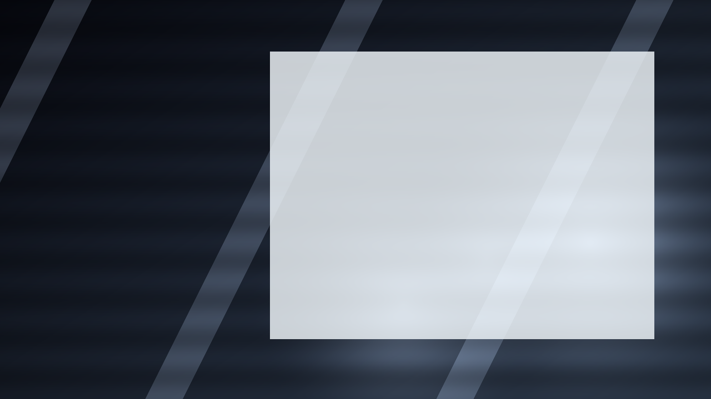

# GHOSTWIRE

**Replay a run like a forensic sim.**

_Status: Horizon only — future idea, not active build work._

## Why this would be wiz

Replay a run like a forensic sim. That means less duct-taped nonsense, more readable chrome, and one more way for Chummer to feel like the tool you brag about instead of the one you apologize for.

## The brutal truth

If nobody can replay the action history, every rules dispute becomes a memory contest with worse lighting.

## The use case

You scrub through a run, see event echoes and state changes, and figure out which move actually tripped the alarms before the shouting starts.

## What is the idea?

GHOSTWIRE is a future rabbit hole worth documenting because it solves a real problem in a way that could make Chummer feel sharper, weirder, and more alive.

## What problem does it solve?

After a chaotic session, everybody remembers events differently and everybody suddenly becomes a professional liar.

## Foundations first

- session authority and event history
- evidence labeling
- replayable receipts
- clean sync seams

## Which parts would it touch later?

- `play`
- `run-services`
- `design`

## Why it waits

Because replay only works if the session/event model is first-class instead of implied.
---

_Last synced: 2026-03-11_  
_Derived from: chummer6-design horizon guidance, current public shape_  
_Canonical source: chummer6-design_
