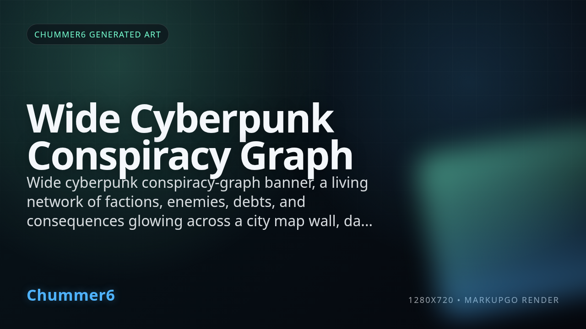

# HEAT WEB

 _[campaign consequences, now with fewer GM memory miracles and more receipts.](../assets/horizons/heat-web.png)_

**The street never forgets a face, especially when it's indexed.**

_Status: Horizon only — future idea, not active build work._

## What problem does this solve?

Most campaigns lose their edge because the fallout is a pile of loose narrative threads that never actually pull tight enough to matter.

## A real table scene

The crew thinks last run vanished into the rain. The city disagrees.

> **Player** 
> "That gang probably forgot about us."

> **GM** 
> "That is adorable."

> **Chummer6** 
> "Heat graph updated. You now owe favors in two districts and a bartender wants you gently dead."

> **Player** 
> "So consequences are a service now?"

> **GM** 
> "Apparently, and the dev made them searchable."

## Meanwhile, Chummer is doing this

- linking events, factions, debts, and witnesses into one graph
- tracking delayed fallout instead of waiting for GM memory miracles
- grounding future pressure in recorded actions
- surfacing who is mad, why, and how soon it matters

## Why that would be great

Campaign consequences stop evaporating and start feeling like a living city with receipts and grudges.

## Why it is still a Horizon

We're hardening the event and evidence plumbing first; a fancy graph of broken data is just a pretty way to lie to yourself about your survival odds.

## What would need to exist first

- grounded event streams
- durable evidence receipts
- stable artifact publication

## Pitch your own future

If your table pain is not forgotten consequences, browse the other bad futures in the [Horizons index](README.md).
---

_Last synced: 2026-03-13_ 
_Derived from: chummer6-design horizon guidance, current public shape_ 
_Canonical source: chummer6-design_
