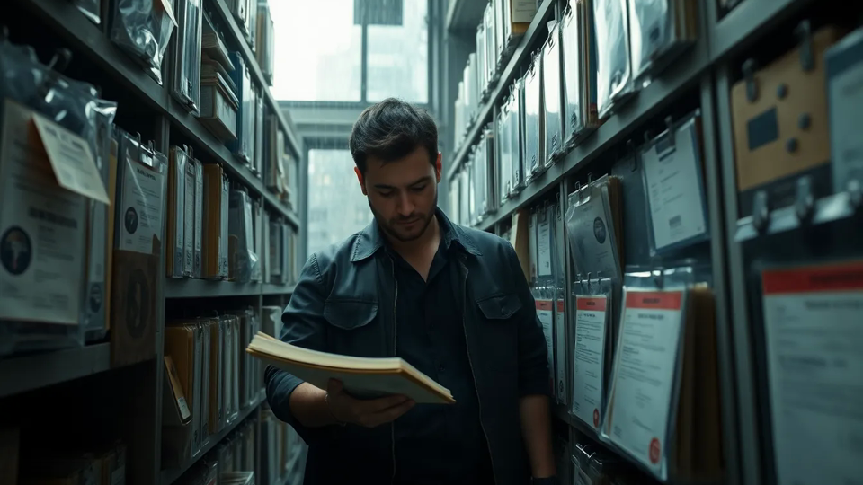
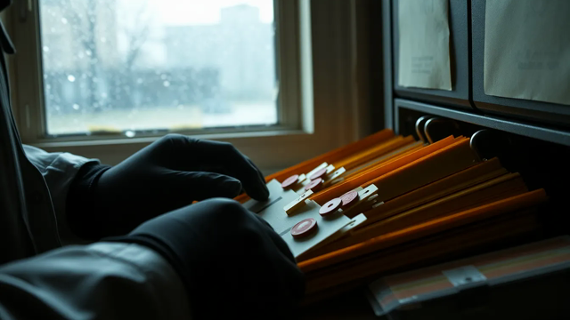

# JACKPOINT

 _[dossiers, dead drops, and better receipts.](../assets/horizons/jackpoint.png)_

**Finished-feeling packets that still show where the facts came from.**

_Status: Horizon only — future idea, not active build work._

## What problem does this solve?

Dossiers and recaps get much less useful the moment polish starts making facts up.

## A real table scene

Face: The packet finally tells me which guard swaps at 02:10 and which door was chained shut last night.
GM: Good. Brief the team from that instead of from my raw notes.
Decker: Every claim still points back to the witness note, camera grab, or receipt it came from.
Rigger: So if one timing is wrong, we can see which source lied instead of arguing with the whole dossier.
GM: Exactly. Clean enough to brief from, honest enough to cross-check.

## Meanwhile, Chummer is doing this

- The packet still has to stay readable without hiding where each claim came from
- If polish makes the facts feel cleaner than they were, the whole thing gets less trustworthy, not more

## Why that would be great

It could turn grim notes into packets people actually want to open, use, and share at the table.

## Why it is still a Horizon

A dossier that reads beautifully but blurs the evidence is still a bad brief, so this stays hypothetical until the proof survives the polish.

## What would need to exist first

- C0
- C1
- C1c
- E2b

## Pitch your own future

Make the packet feel finished without making the facts up.
---

Updated: 2026-03-24
