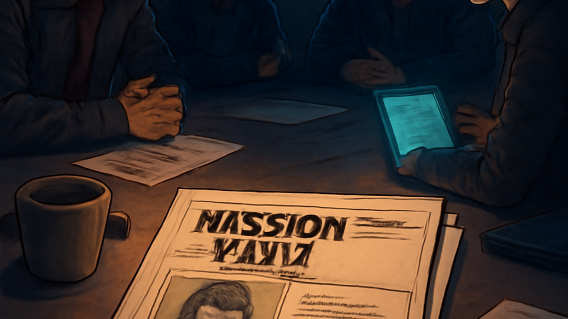
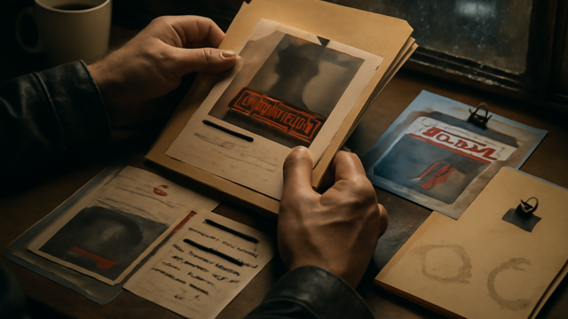

# JACKPOINT

 _[dossiers, dead drops, and better receipts.](../assets/horizons/jackpoint.png)_

**The table gets polished short-to-medium-form dossiers, recaps, and briefings that still show where the facts came from.**

_Status: Horizon only — future idea, not active build work._

## What problem does this solve?

I want dossiers, recaps, and briefings that feel good without making things up.

## A real table scene

The GM wants a brief. The table wants style without lies.

> **GM** 
> "Give me a mission brief for tonight."

> **Player** 
> "But no made-up nonsense this time."

> **Chummer6** 
> "Compiled from session notes, character facts, and approved evidence."

> **Player** 
> "What about the red labels?"

> **Chummer6** 
> "Red is inferred. White is verified. Coffee stains remain optional."

> **GM** 
> "Good. Now the team can tell style from certainty."

## Meanwhile, Chummer is doing this

- pulling together notes, facts, and approved artifacts
- labeling source class and approval state
- keeping inferred material visibly separate from grounded evidence
- preserving provenance instead of laundering guesses into fact

## Why that would be great

The table gets polished short-to-medium-form dossiers, recaps, and briefings that still show where the facts came from.

## Why it is still a Horizon

Because grounded evidence and render boundaries need to settle first. Style without receipts is just prettier confusion.
