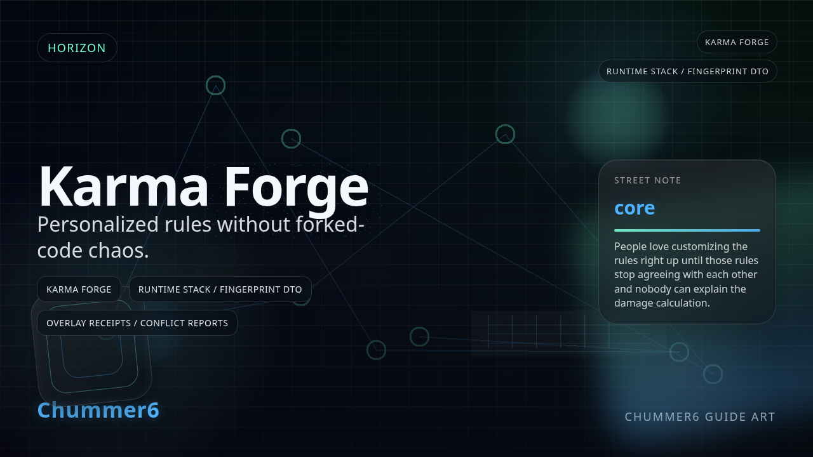

# KARMA FORGE

 _[house rules with receipts, not forked-code folklore and a group chat apology.](../assets/horizons/karma-forge.png)_

**House rules with governance instead of fork chaos.**

_Status: Horizon only — future idea, not active build work._

## What problem does this solve?

Tables want variation without turning every campaign into unreadable folklore.

## A real table scene

GM: I want the house rule, not the forked-code religion that comes with it.
Player: Fine, but I want to know whether it still plays nice with the rest of the sheet.
Rigger: And I want rollback before somebody ships a clever disaster.
GM: That is why this is a forge and not a pastebin.
Player: Good. Keep the receipts hotter than the hype.

## Meanwhile, Chummer is doing this

- Approval, compatibility, and rollback still eat real effort before this lane is safe.
- Booster here only means the dev may burn API-side budget on experiments; normal UI use on your account stays the same unless you built your own tooling on that same API budget.
- Broader access later is still the hope, but nobody should read this as a promise that anything useful or shippable comes out of the spend.

## Why that would be great

It could let tables evolve rules without splintering into silent canon, unreadable forks, or post-hoc apology culture.

## Why it is still a Horizon

This stays booster-first while the lane is still expensive to operate safely, and even then the honest promise is only API-side experiment budget for development work; you may still get nothing useful out of it.

## What would need to exist first

- A1
- A2
- C0
- D2

## Pitch your own future

Evolve the rules without pretending every clever hack deserves to become canon.
---

Updated: 2026-03-20
