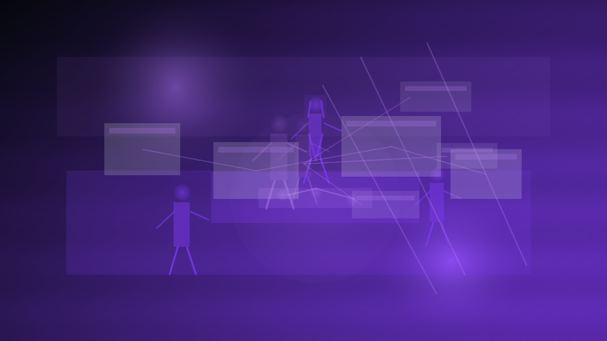

# MIRRORSHARD

**Before you lock the sheet, pit two futures in a cage match and read the damage report.**

_Status: Horizon only — future idea, not active build work._

## Why this would be wiz

Before you lock the sheet, pit two futures in a cage match and read the damage report.

## The brutal truth

Most devs call it “decision support” after they’ve already hard-committed bad branches. You want the real thing: compare both bad ideas first, then pick the one that won’t brick your run.

## The use case

MIRRORSHARD is on deck for when a build or run plan hits a fork: you line up Path A vs Path B, scan a human-readable diff, preview migration impact, and commit with preview/apply/rollback receipts instead of superstition.

## What is the idea?

Before you lock the sheet, pit two futures in a cage match and read the damage report.

## What problem does it solve?

Big choices are easier to trust when you can compare forks without turning the program into a pile of permanent branches.

## Foundations first

- preview/apply/rollback receipts
- comparison-ready provenance
- migration previews

## Which parts would it touch later?

- `presentation`
- `run-services`
- `design`

## Why it waits

Because comparison tooling depends on clean receipts, and those receipts are still being forged.
---

_Last synced: 2026-03-11_  
_Derived from: chummer6-design horizon guidance, current public shape_  
_Canonical source: chummer6-design_
