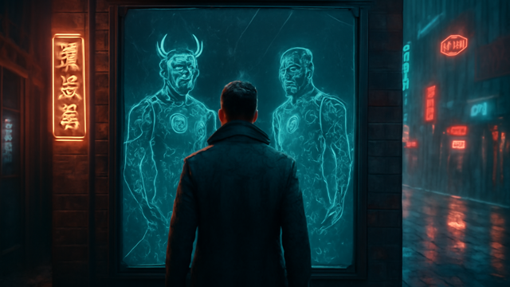

# MIRRORSHARD

 _[compare both bad ideas before the dev asks you to commit to one.](../assets/horizons/mirrorshard.png)_

**Compare alternate futures before you commit the chrome to the bone.**

_Status: Horizon only — future idea, not active build work._

## What problem does this solve?

Most tools treat character progression like a one-way flight into a brick wall. Devs love to tell you to 'just branch it,' as if you're running a Git repo instead of a street-sam with a bleeding head wound and three hours of theory-crafting on the line. In the current state of the sprawl, 'undo' is usually a prayer or a manual file backup that you'll definitely forget to rename until it's too late.

## A real table scene

[GM]: "The Ripper's got two options for your arm. The wired-reflexes-compatible model, or the one that actually lets you hold a heavy weapon without snapping your radius."
[SAMI]: "Wait, if I take the Wired 2, does my Reaction boost offset the Agility loss on the heavy mount?"
[GM]: "Check your Mirrorshard tab. I pushed both manifests to your commlink."
[SAMI]: "Option A puts me at 0.02 Essence. Option B gives me a higher dice pool but I lose the extra Initiative pass."
[GM]: "Tick-tock. The anesthetic is wearing off."
[SAMI]: "Option B. I'll take the recoil over the twitch."

## Meanwhile, Chummer is doing this

- Hardening the math engine to ensure every stat fork is mathematically sound and deterministic.
- Refining local-first storage so your 'what-if' builds don't bloat your browser cache.
- Scripting Lua-based migration receipts that show exactly why your stats changed between versions.

## Why that would be great

Everyone says they want meaningful choices, but what they usually mean is they want to compare both mistakes before they marry one. Mirrorshard turns that desire into a tactical HUD. It generates a side-by-side comparison of two character states—Path A versus Path B—complete with math receipts that explain exactly where your Nuyen and Essence are going. Instead of staring at a spreadsheet and hoping your mental math is right, you get a 'ghost image' of your future self, allowing you to A/B test your soul before you finalize the surgery.

## Why it is still a Horizon

This is deep Horizon territory. Building a system that can track multiple 'simulated futures' without corrupting your primary character record requires a deterministic engine more stable than a corporate black site. We're currently perfecting the way the UI handles 'diffing' complex character data so it doesn't just look like a wall of red and green text, but an actual comparison of your tactical capabilities.

## What would need to exist first

- preview/apply/rollback receipts
- comparison-ready provenance
- migration previews

## Pitch your own future

Got a cleaner way to visualize the moment you trade your humanity for a few extra dice? Pitch it at the repo.
---

Updated: 2026-03-13
