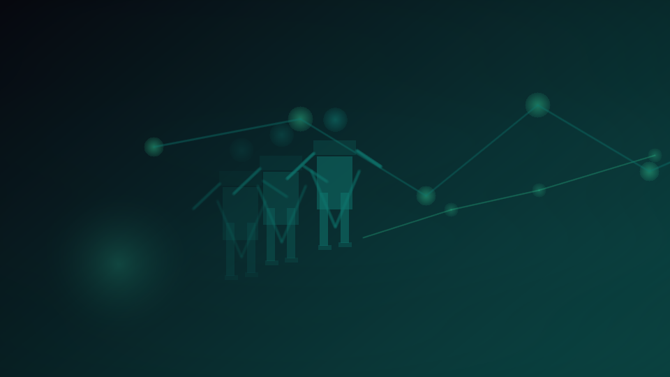
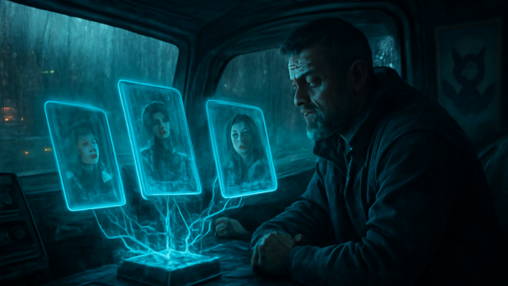

# NEXUS-PAN

 _[Wi-Fi died; the table did not. That is the fantasy.](../assets/horizons/nexus-pan.png)_

**Stop emailing PDFs like it is 2011 and start running a live tactical mesh.**

_Status: Horizon only — future idea, not active build work._

## What problem does this solve?

Your 'table' is currently a digital graveyard of 'Final_V2_REALLY_FINAL.pdf' attachments and GMs squinting at grainy screenshares. When the Wi-Fi hiccups, the session logic flatlines because nobody actually knows who spent what Edge or which grunt took the last Alpha-Strike. It is not a team; it is a collection of isolated spreadsheets having a very slow, very polite argument about what actually happened three initiative passes ago while the immersion dies in a pile of 'did you get my email?' pings.

## A real table scene

GM: The Renraku Red Samurai fires. Take 12P, soaked by... wait, who has the current host map? Decker: I do. Just dropped a Data Spike. Wait, my phone just hit a dead zone. Samurai: My sheet says I have 3 Edge. GM says I have 0. Who is right? Mage: I emailed my updated spell list an hour ago. Did you get it? GM: I am still looking at your V2 file from last Tuesday. Everything is fragged. Decker: Grid is back. Re-syncing... Team: Okay, we are all seeing the same fire-fight again. Finally.

## Meanwhile, Chummer is doing this

- Building the append-only event log so your session history is a ledger, not a guess. - Hardening local-first replay logic for those basement runs where the signal goes to die. - Defining the session authority profile so the GM stays the boss, even in a distributed mesh.

## Why that would be great

Imagine a tactical environment where every device at the table—from the GM’s rig to the street sam’s burner phone—pulses with the same deterministic truth. NEXUS-PAN treats your session as a living mesh, using append-only event streams to ensure that when the Decker marks a host or the Mage burns Edge, every HUD at the table updates in real-time. It is the difference between a static dossier and a live tactical overlay; it is the distributed brain your team actually needs to survive a high-stakes extraction without the 'spreadsheet drift' killing the vibe.

## Why it is still a Horizon

Syncing state across five different browsers on three different OSs while handling offline conflicts is a digital landmine. We are currently focused on getting the core engine math and Lua-driven rulesets rock-solid before we try to wire everyone’s brains together. We would rather you have a perfect solitary engine today than a broken, desynced mess of a 'connected' experience that eats your character data for breakfast. Multi-device sync is the crown jewel of the long-range plan, but we are still cutting the facets on the core stone.

## What would need to exist first

- session authority profile
- append-only session events
- local-first sync and replay
- clean play API seams

## Pitch your own future

Got a cleaner way to bridge the gap between devices without the cloud-bloat? Drop a data-trail in our issue tracker.
---

Updated: 2026-03-13
