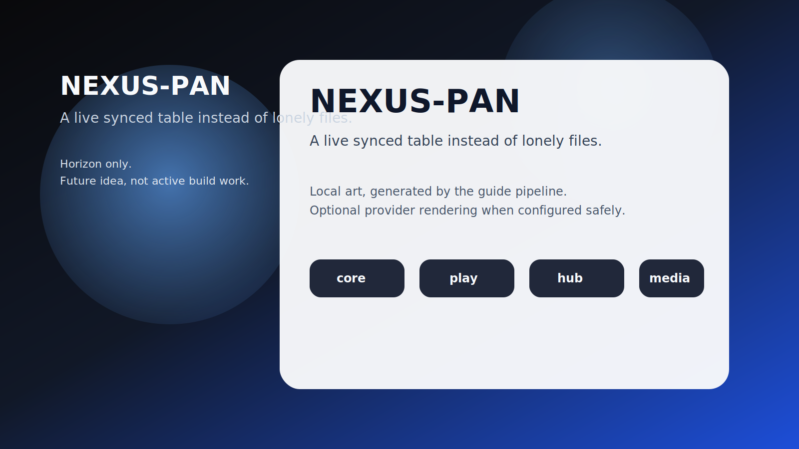

# NEXUS-PAN

**A live synced table instead of lonely files.**

_Status: Horizon only — future idea, not active build work._

## The brutal truth

A folder full of character files is not a live table. It is a very quiet argument waiting to happen.

## The use case

The GM, players, and devices all see the same session state, even if a phone dips offline for a minute and then claws its way back into the run.

## What is the idea?

NEXUS-PAN is a future rabbit hole worth documenting because it solves a real problem in a way that could make Chummer feel sharper, weirder, and more alive.

## What problem does it solve?

Sessions want shared authority, resilient sync, and live state that survives dodgy networks and chaotic tables.

## Foundations first

- session authority profile
- append-only session events
- local-first sync and replay
- clean play API seams

## Which parts would it touch later?

- `play`
- `run-services`
- `core`
- `design`

## Why it waits

Because the play split still needs its event-log, cache, and sync foundations to become real before the dream gets chrome.
---

_Last synced: 2026-03-11_  
_Derived from: chummer6-design horizon guidance, current public shape_  
_Canonical source: chummer6-design_
