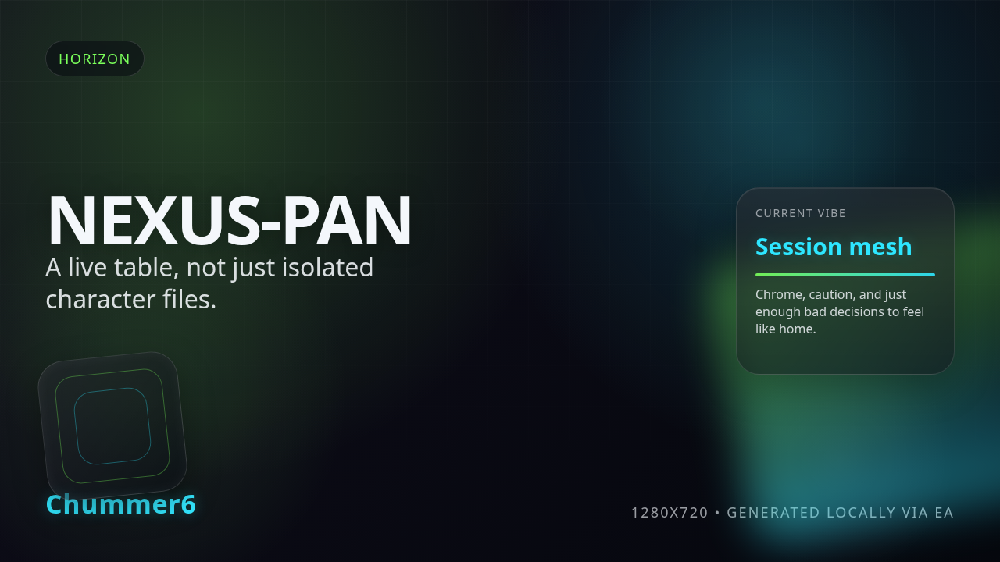
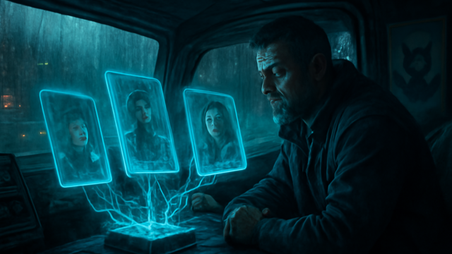

# NEXUS-PAN

 _[session continuity after the link gets ugly.](../assets/horizons/nexus-pan.png)_

**Shared state survives device churn without the table losing trust.**

_Status: Horizon only — future idea, not active build work._

## What problem does this solve?

My devices drift and the table loses confidence.

## A real table scene

Rain hits the windows, one phone just rejoined, and nobody wants a sync argument.

> **GM** 
> "Rain comes down hard. Visibility drops. Security just woke up."

> **Decker** 
> "My phone died. I missed the last two actions. It chose performance art."

> **Street Sam** 
> "I already burned one Edge and took 3 stun, right?"

> **Mage** 
> "And I am still sustaining that spell. Probably."

> **Chummer6** 
> "Decker device rejoined. Replayed 6 missed events. Current initiative: 11. Rain penalty applied."

> **GM** 
> "Good. Nobody do forensic accounting. Keep going."

## Meanwhile, Chummer is doing this

- keeping session state as one shared event stream
- recording who changed what and when
- replaying missed turns onto the rejoined device
- showing the same initiative, resources, and effects to everyone

## Why that would be great

Shared state survives device churn without the table losing trust.

## Why it is still a Horizon

Because the play split still needs its event-log, cache, and sync foundations to become real before the dream gets chrome.
