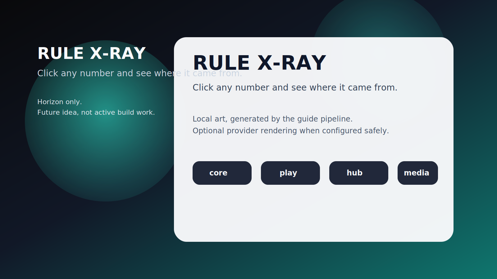

# RULE X-RAY

**Click any number and see where it came from.**

_Status: Horizon only — future idea, not active build work._

## The brutal truth

Shadowrun math feels like witchcraft until the machine can point at every buff, wound, penalty, and bad life choice in the stack.

## The use case

A dice pool looks wrong, you crack open the x-ray view, and the whole chain of causes lights up without hand-waving.

## What is the idea?

RULE X-RAY is a future rabbit hole worth documenting because it solves a real problem in a way that could make Chummer feel sharper, weirder, and more alive.

## What problem does it solve?

Opaque math is one of the fastest ways for a rules tool to lose trust at the table.

## Foundations first

- explain canon
- provenance receipts
- deterministic engine evaluation

## Which parts would it touch later?

- `core`
- `presentation`
- `design`

## Why it waits

Because the explain/provenance line still needs to finish becoming boringly canonical first.
---

_Last synced: 2026-03-11_  
_Derived from: chummer6-design horizon guidance, current public shape_  
_Canonical source: chummer6-design_
