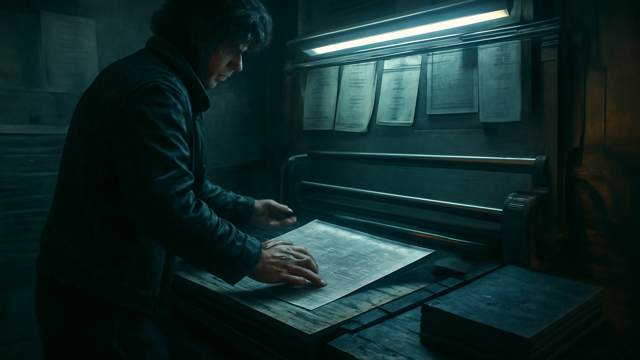

# RUNBOOK PRESS

**Long-form publishing becomes something you can actually reuse instead of a ten-tool scramble.**

_Status: Horizon only — future idea, not active build work._

## What problem does this solve?

I want real primers, handbooks, and campaign books without duct-taping ten tools together.

## A real table scene

Long-form publishing becomes something you can actually reuse instead of a ten-tool scramble.

## Why that would be great

Long-form publishing becomes something you can actually reuse instead of a ten-tool scramble.

## Why it is still a Horizon

It stays parked until the current product can prove the basics well enough.
