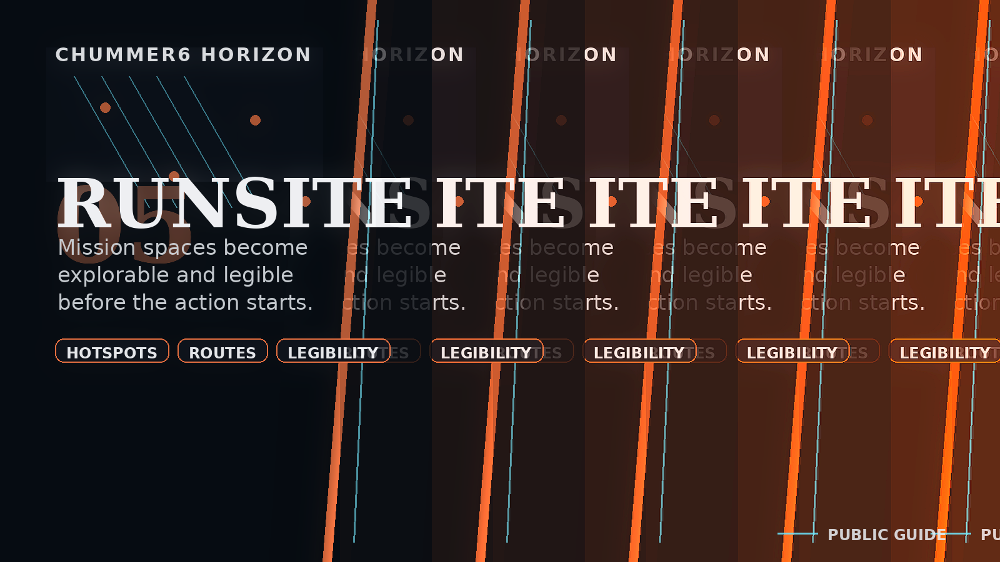

# RUNSITE

**Mission spaces that become legible before the bullets do.**

_Status: Horizon only — future idea, not active build work._

## What problem does this solve?

A briefing is still doing half the work if the table cannot read the space.

## A real table scene

A ghosted floor plan climbs the wet concrete between the crates.
GM: Here is the site before anyone has to improvise the floor plan from memory.
Player: Good. I would like to know where the exits are before I need one.
Rigger: Route overlay makes sense for once.
Chummer6: West stair choke point marked. Two cleaner ingress lanes still open.
Face: So the room stops being a surprise punishment box.
GM: Exactly.

## Meanwhile, Chummer is doing this

- Briefing-space artifacts have to stay bounded and useful instead of drifting into fake live-session truth
- The lane only works if mission-space clarity gets better without pretending to be a VTT replacement

## Why that would be great

It could make mission spaces easier to read before the action starts, which is usually when that clarity matters most.

## Why it is still a Horizon

Spatial help is only worth shipping if it stays bounded to briefing and planning instead of promising a whole combat shell by accident.

## What would need to exist first

- C1
- C1c
- E2b

## Pitch your own future

Make the site legible before the run makes it urgent.
---

Updated: 2026-04-26
