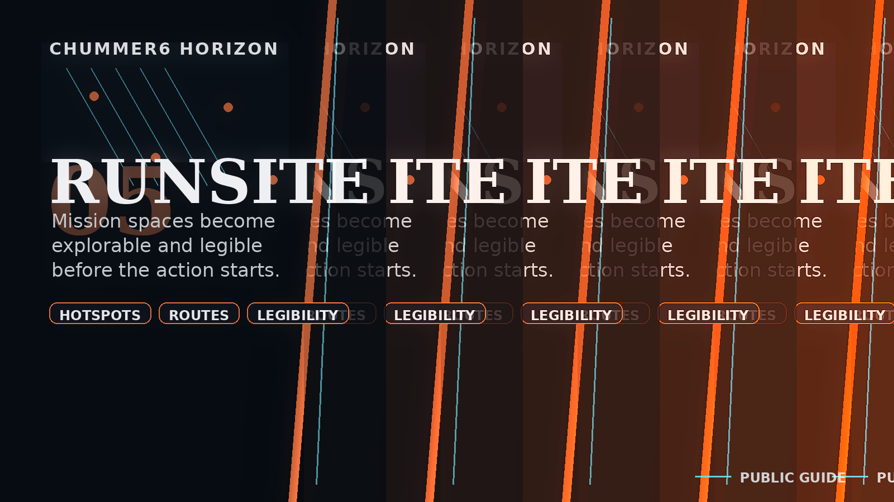
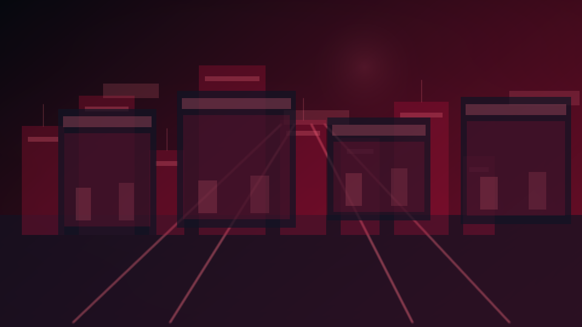

# RUNSITE

**Mission spaces become explorable and legible before the action starts.**

_Status: Horizon only — future idea, not active build work._

## What problem does this solve?

My players still misread the space even after the briefing.

## A real table scene

Mission spaces become explorable and legible before the action starts.

## Why that would be great

Mission spaces become explorable and legible before the action starts.

## Why it is still a Horizon

It stays parked until the current product can prove the basics well enough.
