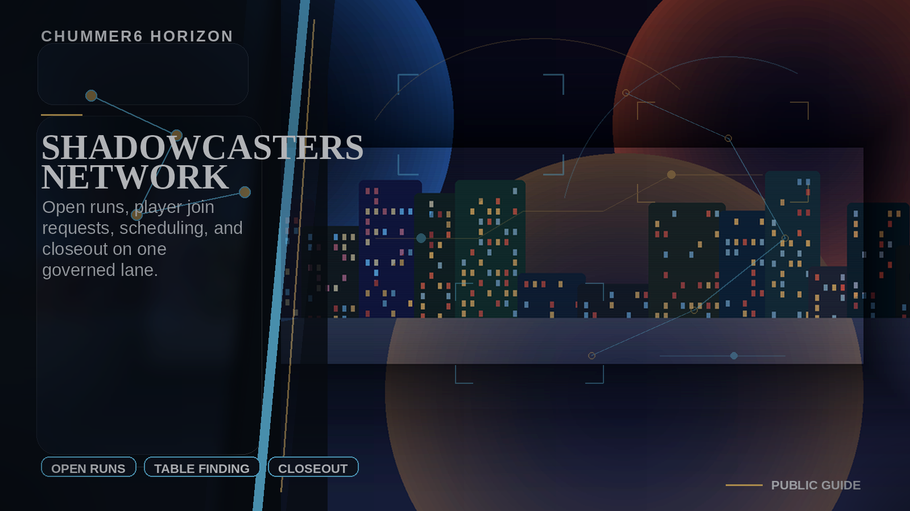
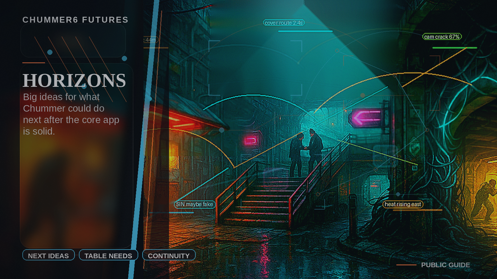

# SHADOWCASTERS NETWORK

**Open-run recruiting, scheduling, prep, and closeout built on governed campaign truth.**

_Status: Horizon only — future idea, not active build work._

## What problem does this solve?

Finding a run is easy to fake; finding the right table, legal runner, consent boundary, and closeout loop is not.

## A real table scene

Player: I found a beginner-friendly run, but I need to know whether my runner actually fits.
Chummer6: Seat request checked against table limits, consent tags, and prep packet requirements.
GM: I want scheduling handled, not another loose chat thread.
Organizer: And the result has to close back into the city after the run.
Chummer6: Roster, handoff, and resolution report stay attached to the same job.
Player: Good. I want a table, not a rumor with a calendar link.

## Meanwhile, Chummer is doing this

- Open-run access only works if job packets, runner legality, consent, and scheduling stay governed
- BLACK LEDGER consequences must be trustworthy enough before open tables can feed them
- Closeout needs to return useful world truth without exposing private table details

## Why that would be great

It could turn campaign prep into a practical network where players find real seats, GMs get usable rosters, and completed sessions feed the living world with reviewable closeout.

## Why it is still a Horizon

The network should wait until job packets, authority handoff, consent policy, and BLACK LEDGER consequence flow can hold up under real community use.

## What would need to exist first

- C0
- C1
- D0
- D1
- D2
- E2b
- F1

## Pitch your own future

Find the run, fit the runner, schedule the table, and close the result back into the city.
---

Updated: 2026-04-25
