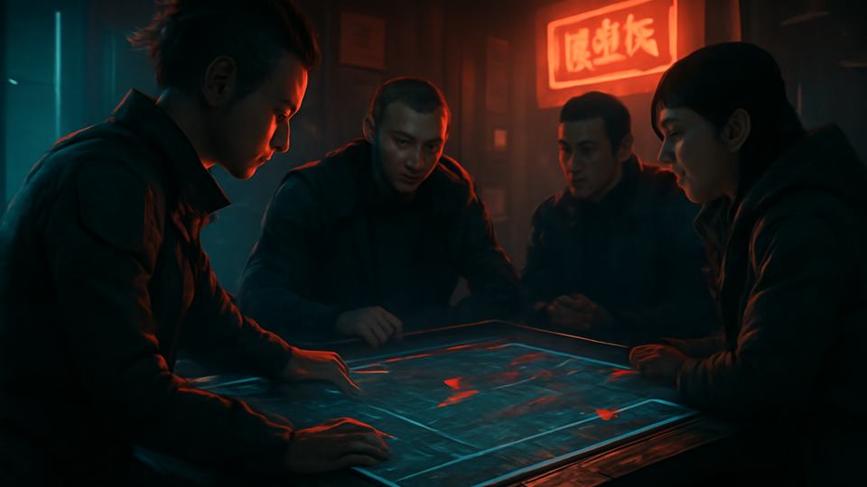
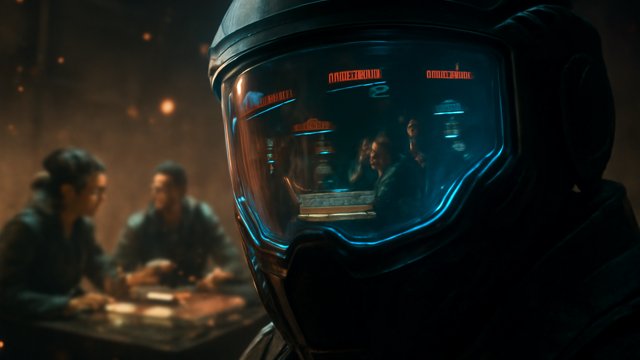

# Tactical Pulse

 _[shared situational awareness for the exact moment everyone swears they were paying attention.](../assets/horizons/tactical-pulse.png)_

**Sync your team's sensors before the noise hits the fan.**

_Status: Horizon only — future idea, not active build work._

## What problem does this solve?

A live table needs a shared picture of threats, allies, penalties, and state changes while the scene is still moving.

## A real table scene

Everyone swears they are paying attention. The combat state says otherwise.

> **GM** 
> "The drone is flanking, the mage is lit, and the hallway is worse now."

> **Player** 
> "Can somebody repeat the last three important things?"

> **Chummer6** 
> "Shared pulse updated. Threat icons, ally states, active penalties, and priorities are live."

> **GM** 
> "Finally. Situational awareness as a service."

## Meanwhile, Chummer is doing this

- summarizing live state into one shared tactical view
- tracking threats, allies, penalties, and shifting priorities
- grounding summaries in actual session authority
- helping the table stop re-asking the same urgent question

## Why that would be great

Shared awareness turns combat confusion back into tactics instead of repeated recap labor.

## Why it is still a Horizon

Shared awareness features only make sense once session authority, sync, and grounded summaries are already dependable enough to trust with your life.

## What would need to exist first

- session authority
- event envelopes
- local-first sync
- evidence-grounded summaries

## Pitch your own future

If your table pain is not collective amnesia under fire, the [Horizons index](README.md) holds other future fixes.
---

_Last synced: 2026-03-13_ 
_Derived from: chummer6-design horizon guidance, current public shape_ 
_Canonical source: chummer6-design_
