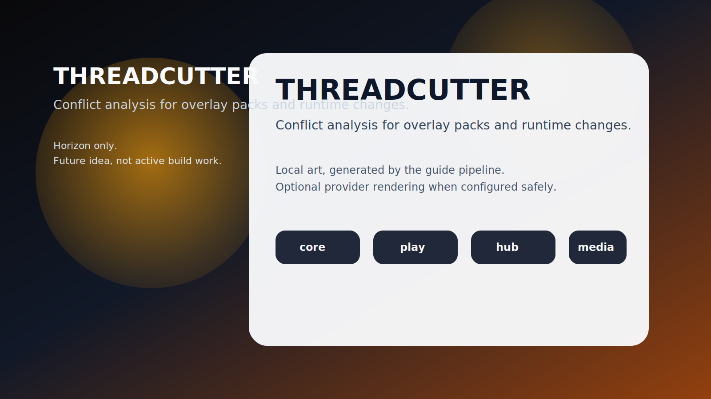

# THREADCUTTER

**Conflict analysis for overlay packs and runtime changes.**

_Status: Horizon only — future idea, not active build work._

## The brutal truth

Every cool customization story eventually ends with two mods both insisting they are the chosen one.

## The use case

You get a conflict report before two overlays collide in production and turn your rule stack into abstract art.

## What is the idea?

THREADCUTTER is a future rabbit hole worth documenting because it solves a real problem in a way that could make Chummer feel sharper, weirder, and more alive.

## What problem does it solve?

Sooner or later, two clever changes will try to claim the same space at the same time.

## Foundations first

- conflict reports
- migration previews
- apply and rollback receipts

## Which parts would it touch later?

- `run-services`
- `play`
- `design`

## Why it waits

Because the runtime stack model and migration receipts must exist before conflict analysis has anything honest to inspect.
---

_Last synced: 2026-03-11_  
_Derived from: chummer6-design horizon guidance, current public shape_  
_Canonical source: chummer6-design_
