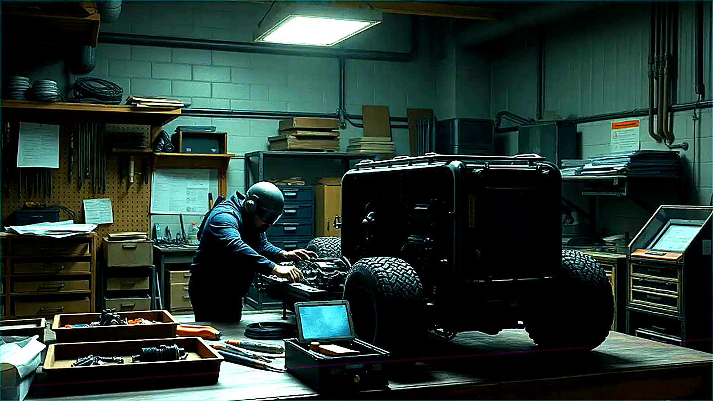

# Current Phase

The current phase is public preview with the trust surface moving into focus.

The product is earning confidence through a sharper guide, a clearer status readout, stronger support paths, and proof artifacts that are becoming easier to inspect. That is still an unfinished phase, but it is no longer just abstract concept framing.

## The focus right now

- lock in the rules and session boundaries
- keep live play and prep from bleeding into each other
- make the shared UI pieces feel consistent instead of improvised
- finish the registry and media services that support the public surfaces
- keep public previews honestly labeled until they become the real thing

## What this means for your next session

If you are using Chummer6 at the table tonight, read this phase as: trust work first. The important promise is that the math should be traceable and the session should not die just because Wi-Fi did. If a page still says preview, read that as "shape can move," not "the engine is fake."

## Why that matters

This is the work that makes later wow-ideas cheap instead of chaotic.

No neon spoiler matters if the frame is still loose.
---

Updated: 2026-04-25
