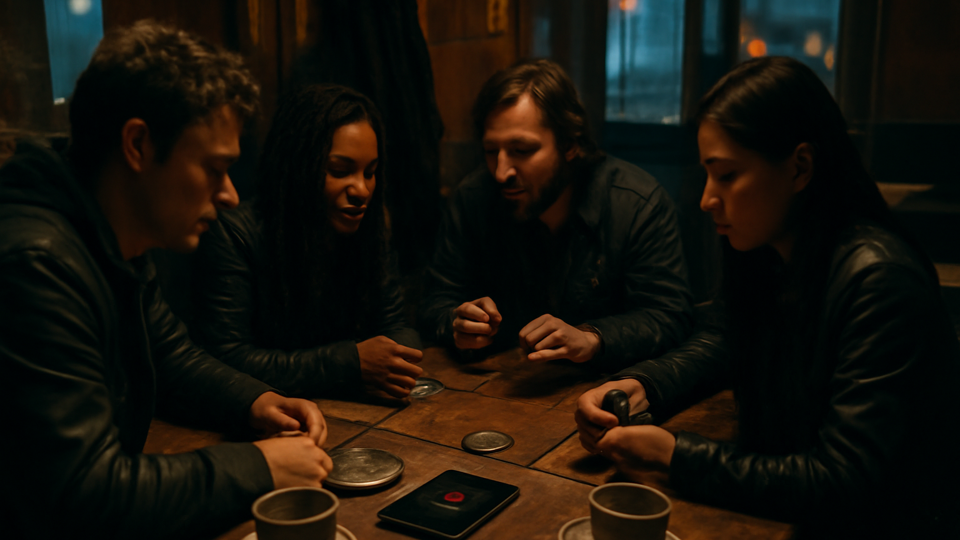

# Current Status

Current status is practical: usable now, transparent where it counts, and still clearly evolving.

## The short version

- the split is real
- the public surfaces are still preview, not the final public shape
- play is still the next major product seam to finish
- UI kit, registry, and media exist, but are still becoming fully real boundaries
- the blueprint is still catching up in a few places

## What this means for normal humans

You can already make build and rules decisions, inspect receipts to see why they happened, and keep playing locally across desktop, browser, and table-facing session flow without betting everything on cloud uptime. Multi-era support is part of the visible story, and scripted Lua rules give ugly edge cases a real home.

## What this means for your next session

If the session is tonight, the useful reading is simple: the product is real enough to inspect math and run locally, but some public surfaces are still marked preview because the promoted shape is not final yet. That label is about maturity and ownership, not about the rules engine bluffing.
---

_Last synced: 2026-03-13_  
_Derived from: current public shape, chummer6-design program milestones_  
_Canonical source: chummer6-design_
