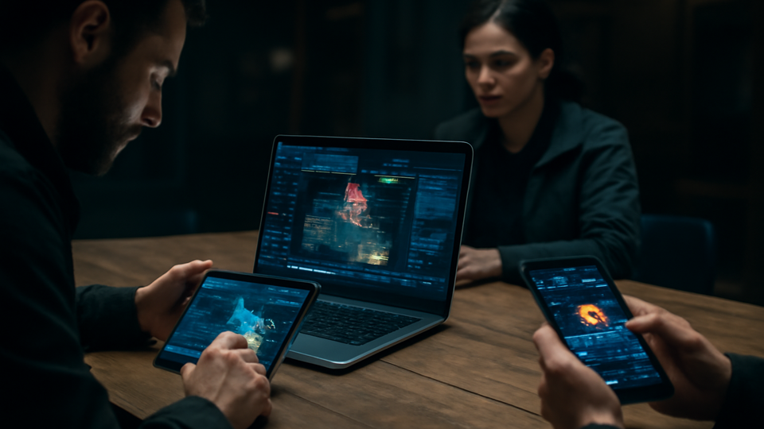

# Public Surfaces

Here is the short version: the visible screens are usable now, and they already cover real table work across desktop, browser, and mobile-style play views.

## Current public reality

You can build and run sessions offline, install the web app like an app, and inspect rules receipts that show how a call was made. Some layout and flow details are still marked preview, which means the shape can change as people use it, not that the core math is fake.

These are still preview, not the final public shape:

- portal root
- hub preview
- workbench preview
- play preview
- coach preview

## What this means for your next session

If you are deciding whether to trust the visible surfaces tonight, the answer is: use them as real previews. Expect them to work, expect some shape changes later, and do not mistake the preview label for "toy." The more important dividing line is whether a surface has earned promotion yet, not whether it exists.

## Why that label exists

It means the surface is there, but the code, blueprint, ownership, and deployment story do not line up cleanly enough yet to call it the real promoted version.
---

_Last synced: 2026-03-13_  
_Derived from: current public surface status_  
_Canonical source: chummer6-design_
