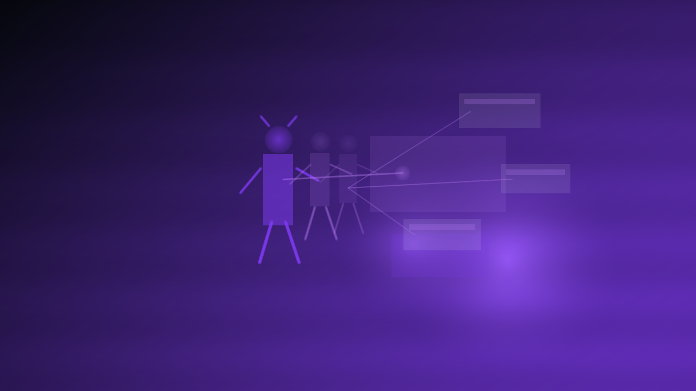

# Play

        **The part you feel at the table.**

        Play is where Chummer6 quits prep mode and hits the street. It is the live player/GM shell for session night on phone, laptop, or browser: local-first state, offline survival, clean sync when signal comes back, and replayable receipts when someone says, "that roll looks cursed."

        ## Why you should care

        If this never works, Chummer stays a great builder and never becomes mission control. Play is the jump to real table momentum: trustable outcomes, fewer Wi-Fi meltdowns, and less "wait, what just happened" drama for players, GMs, and sleep-deprived devs.

        ## What it owns

        - player and GM play shell
- local-first session state
- runtime stack consumption
- sync-friendly play flows

        ## What it does not own

        - builder/workbench UX
- provider secrets
- copied shared interfaces

        ## What is happening now

        This seam is actively being built, and the focus is reliability over shiny chrome. Current work is event logs, runtime cache, offline queueing, sync recovery, and replay receipts so live sessions stay moving before we chase flash.

        ## Go deeper

        - [Program map](README.md)
        - [Current phase](../NOW/current-phase.md)
        - [Where to go deeper](../WHERE_TO_GO_DEEPER.md)
---

_Last synced: 2026-03-11_  
_Derived from: chummer6-design ownership map, current public shape, owning repo READMEs_  
_Canonical source: chummer6-design_
