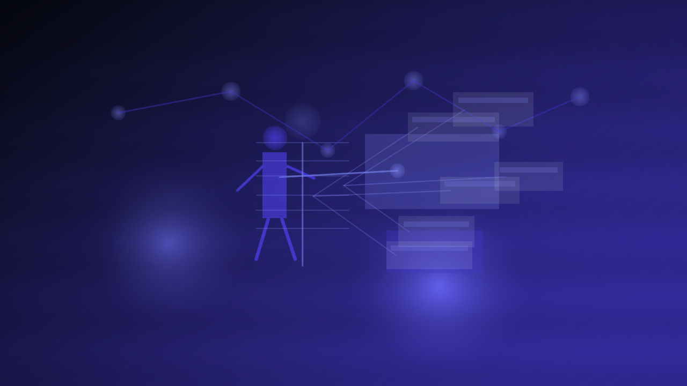

# Presentation

        **The workbench and big-screen UX.**

        Presentation is the heavy-chrome workbench: big-screen inspectors, builders, and deep views for people who like to pop the hood and check the math. If your loadout looks cursed, this is where you trace it, fix it, and move on.

        ## Why you should care

        Shadowrun crunch gets weird fast. Presentation keeps it inspectable instead of mystical, so you can follow receipts, understand outcomes, and trust what you’re bringing to the table.

        ## What it owns

        - browser and desktop workbench UX
- inspectors, builders, and shared presentation seams
- big-screen authoring and review flows

        ## What it does not own

        - the player-first play shell
- hosted orchestration
- render-only asset jobs

        ## What is happening now

        Current move: tighten scope. Keep the workbench power for prep and review, and drop any lingering overlap with live play or hosted concerns. Less turf creep, more clean command deck energy.

        ## Go deeper

        - [Program map](README.md)
        - [Current phase](../NOW/current-phase.md)
        - [Where to go deeper](../WHERE_TO_GO_DEEPER.md)
---

_Last synced: 2026-03-11_  
_Derived from: chummer6-design ownership map, current public shape, owning repo READMEs_  
_Canonical source: chummer6-design_
