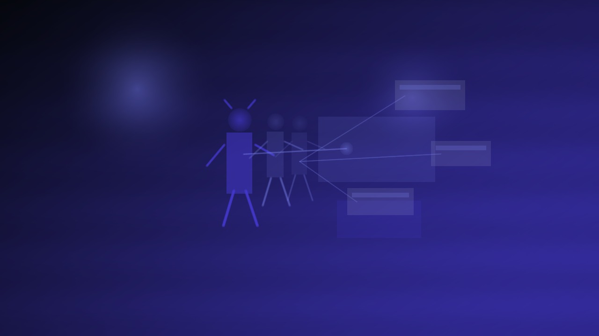

# Run Services

        **The hosted API and orchestration layer.**

        Run Services is the fixer in the back room: it handles identity, relay, approvals, memory, and hosted play APIs so your crew can sync, preview, publish, and recover without drama. It should feel boring when it works, which is exactly the point.

        ## Why you should care

        When your table goes multi-device and the signal gets sketchy, this is the adult supervision that keeps handoffs clean. It coordinates people and state, keeps a receipt trail of who approved what, and supports preview/apply/rollback flows without pretending it owns the rules math.

        ## What it owns

        - identity, relay, approvals, and memory
- hosted play APIs and orchestration
- preview/apply/rollback style server workflows

        ## What it does not own

        - engine math truth
- the long-term play shell
- render-only media execution

        ## What is happening now

        Current mission: shrink-to-fit. Keep Run Services in its lane, make hosted coordination rock-solid, and stop the classic backend sin of trying to be every subsystem at once.

        ## Go deeper

        - [Program map](README.md)
        - [Current phase](../NOW/current-phase.md)
        - [Where to go deeper](../WHERE_TO_GO_DEEPER.md)
---

_Last synced: 2026-03-11_  
_Derived from: chummer6-design ownership map, current public shape, owning repo READMEs_  
_Canonical source: chummer6-design_
