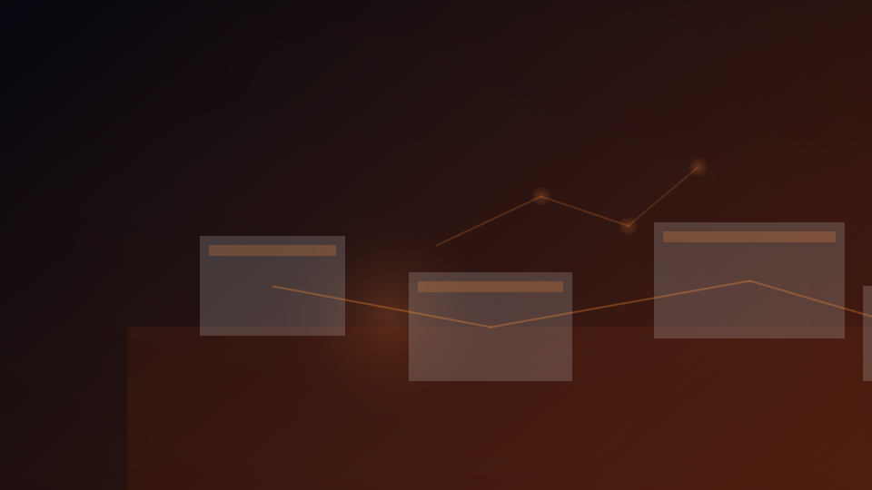

# UI Kit

 _[the bit that stops the split from dressing like eight unrelated crimes.](../assets/parts/ui-kit.png)_

**Shared chrome, themes, and visual primitives.**

UI Kit is the digital chrome for your deck. It provides the themes, badges, and interface tokens that keep the sprawl of modules looking like a single, lethal tool instead of a collection of scavenged parts held together by duct tape and mood swings.

## You touch this when...

This is how we stop the interface from looking like seven different gangs fought over a single monitor. By using shared primitives, we ensure your HUD stays consistent and readable, so you can focus on the run instead of wrestling with a messy layout.

## What it owns

- tokens and themes
- shared chrome and accessibility primitives
- UI-only preview and gallery surfaces

## What it does not own

- domain DTOs
- HTTP clients
- rules math

## What is happening now

The kit proves its worth by making the rest of the project smaller. We're currently stripping out the 'unique' UI hacks and replacing them with professional-grade tokens that work across every era and device.

## Go deeper

- [Program map](README.md)
- [Current phase](../NOW/current-phase.md)
- [Where to go deeper](../WHERE_TO_GO_DEEPER.md)
---

Updated: 2026-03-13
