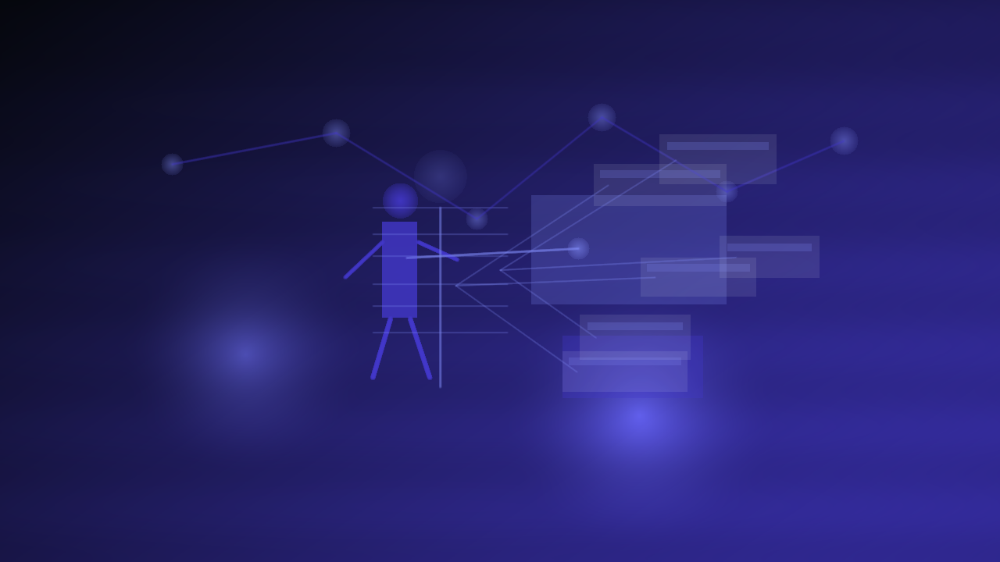

# UI

        **The workbench and big-screen UX.**

        Presentation is the big-screen workbench for people who actually inspect builds. It gives you deep views, fast editors, and clean ways to compare what changed.

        ## Why you should care

        You should be able to see inside the character machine, not click through chrome and pray. This is where prep gets legible before the run gets loud.

        ## What it owns

        - browser and desktop workbench UX
- inspectors, builders, and shared workbench seams
- big-screen authoring and review flows

        ## What it does not own

        - the player-first play shell
- hosted orchestration
- render-only asset jobs

        ## What is happening now

        Right now it stays in its lane: stronger inspectors and builder flows for desktop/browser, cleaner review loops, and zero cosplay as a hosted layer or player-session shell.

        ## Go deeper

        - [Program map](README.md)
        - [Current phase](../NOW/current-phase.md)
        - [Where to go deeper](../WHERE_TO_GO_DEEPER.md)
---

_Last synced: 2026-03-13_  
_Derived from: chummer6-design ownership map, current public shape, owning repo READMEs_  
_Canonical source: chummer6-design_
