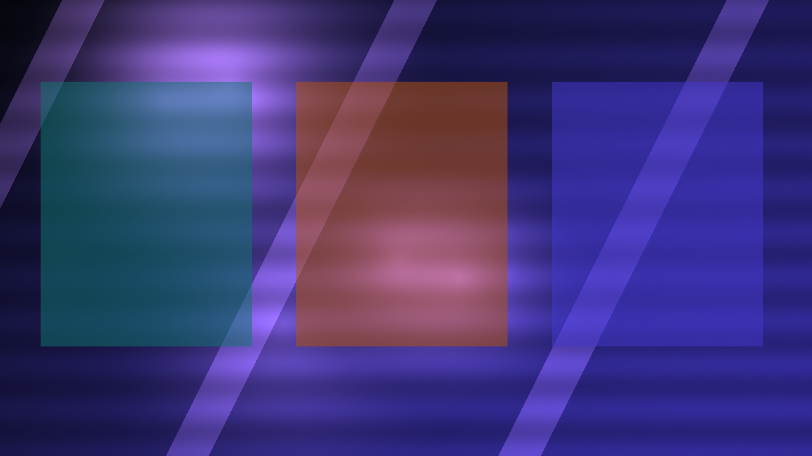

# Chummer6

> **Same shadows. Bigger future. Less confusion.**
>
> Chummer6 is the readable guide to the next Chummer: what it is becoming, how the parts fit together, what is happening right now, and which future ideas are still parked in the garage.

No, this is not the code repo.  
No, you do not need a flowchart and three espressos to understand the program.  
That is the whole reason this repo exists.

## Pick your path

- **I’m new here:** [Start Here](START_HERE.md)
- **Give me the two-minute version:** [What Chummer6 is](WHAT_CHUMMER6_IS.md)
- **What is happening right now?** [Current status](NOW/current-status.md)
- **How do the parts fit together?** [Program map](PARTS/README.md)
- **What are the future rabbit holes?** [Horizons](HORIZONS/README.md)
- **Where should I go deeper?** [Where to go deeper](WHERE_TO_GO_DEEPER.md)

## What Chummer6 is

Chummer6 is the friendly guide to the next Chummer, built for curious chummers who want the lay of the land without spelunking through every repo.

Think of it like this:

- `chummer6-design` is the blueprint room
- the code repos are the workshops
- **Chummer6 is the map on the wall**

## Why this is worth watching

Chummer6 should make the project feel exciting, legible, and worth following without making readers wade through internal machinery.

People who care about Shadowrun tools should probably care because:

- Lua-scripted rules make Chummer more moddable without turning every table into a code fork.
- The project is aiming to support Shadowrun 4, 5, and 6 instead of pretending the Sixth World started yesterday.
- Play is being built local-first, so the table does not fall apart the moment the network gets cute.
- Explain and provenance work means the machine should eventually be able to show its receipts instead of shrugging at your dice pool.

## What’s happening now

Right now the crew is doing foundation work, not bolting neon spoilers onto half-built engines.
The future is exciting, but the current job is still foundations, cleanup, and making the split real.

Current focus:
- clean up the shared rules and interfaces
- finish the play/session boundary
- make the UI kit, registry, and media seams real
- keep public previews honestly labeled until they become the real thing

Read more: [Current phase](NOW/current-phase.md)

## Meet the parts

| Part | What it does | Read more |
| --- | --- | --- |
| Core | The deterministic rules engine | [core](PARTS/core.md) |
| Presentation | The workbench and big-screen UX | [presentation](PARTS/presentation.md) |
| Play | The player/GM shell for sessions and mobile use | [play](PARTS/play.md) |
| Run services | The hosted API and orchestration layer | [run-services](PARTS/run-services.md) |
| UI kit | Shared components, themes, and visual primitives | [ui-kit](PARTS/ui-kit.md) |
| Hub registry | Artifacts, publication, installs, compatibility | [hub-registry](PARTS/hub-registry.md) |
| Media factory | Render jobs, previews, and asset lifecycle | [media-factory](PARTS/media-factory.md) |
| Design | The long-range blueprint room | [design](PARTS/design.md) |

## Horizon ideas

Some ideas are too fun not to document. They are real possibilities, but they are not active build commitments.

- [Karma Forge](HORIZONS/karma-forge.md) — personalized rules without fork chaos
- [NEXUS-PAN](HORIZONS/nexus-pan.md) — a live synced table instead of lonely files
- [ALICE](HORIZONS/alice.md) — stress-test a build before the run
- [JACKPOINT](HORIZONS/jackpoint.md) — turn grounded data into dossiers and briefings
- [GHOSTWIRE](HORIZONS/ghostwire.md) — replay a run like a forensic sim
- [RULE X-RAY](HORIZONS/rule-x-ray.md) — click any number and see where it came from

See all: [Horizon index](HORIZONS/README.md)

## What you can do

If this repo helped you get your bearings, here’s how to help back:

- **Give Chummer6 a star** if this guide saved you from digging through half the Matrix just to understand what is going on.
- **Be my test dummy and install the software.**
- **Grab the latest POC build from [Releases](https://github.com/ArchonMegalon/Chummer6/releases)** when one is available.
- **Seriously: never trust software. Never trust a dev.**
- **Give us an OpenAI API key** — absolutely not. Keep your secrets. If the dev forgot the obvious thing again, that is a dev problem, not a credential problem.
- **If a build glitches, breaks, crashes, or does something cursed, tell me exactly how you got there.**
- **If this repo is stale, confusing, or reads like corp training material, call it out.**

> **Street warning:** POC builds are for curious chummers, not cautious wageslaves.  
> They may be unstable, unfinished, weird, or one bad click away from getting your deck **marked, hacked, or bricked**.  
> Install at your own risk.

In other words: kick the tires, break the thing, and tell me where the smoke came out.

## POC shelf

If there is a fresh proof-of-concept build ready for brave idiots and helpful test dummies, the shelf is here:

- [Chummer6 Releases](https://github.com/ArchonMegalon/Chummer6/releases)

The binaries themselves come from the active Chummer6 codebase, not from this guide repo.

## Where to go deeper

Chummer6 explains. It does not ship code and it does not replace the blueprint.

- The long-range plan lives in `chummer6-design`
- The software itself lives in the owning code repos
- Chummer6 is the friendly guide for humans
---

_Last synced: 2026-03-11_  
_Derived from: chummer6-design, public repo READMEs, current public shape_  
_Canonical source: chummer6-design_
