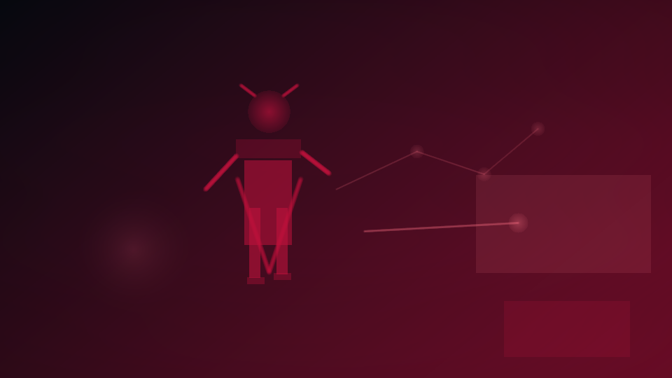

# Chummer6

 _[table truth, wet sleeves, and one troll charm the dev better not lose again.](assets/hero/chummer6-hero.png)_

> **Your character isn't a spreadsheet. It's a dossier.**
>
> Your character dossier is more than a spreadsheet; it's a survival record for the Sixth World.

If you only need the one-sentence pitch, it is this: Chummer6 is trying to help players and GMs answer "what just happened?" fast enough that the run keeps moving.

## Pick your path

- **I am new here:** [Start Here](START_HERE.md)
- **Give me the product story:** [What Chummer6 is](WHAT_CHUMMER6_IS.md)
- **Tell me what is real today:** [Current status](NOW/current-status.md)
- **Show me the parts when I actually care:** [Program map](PARTS/README.md)
- **Show me the future rabbit holes:** [Horizons](HORIZONS/README.md)
- **I want to help without getting lost in repo folklore:** [How can I help?](HOW_CAN_I_HELP.md)
- **Point me at the deeper source material:** [Where to go deeper](WHERE_TO_GO_DEEPER.md)

## What this means at a real table

> **GM** 
> "Rain, noise, and recoil all apply here."

> **Player** 
> "Then why did my pool drop to 9?"

> **Chummer6** 
> "Base 11. Rain -1. Wounds -1. Recoil -1. Final 9."

Chummer6 is a local-first toolkit built to ensure your math stays legal even when the local matrix grid crashes. We use a deterministic engine—which means your stats and modifiers are calculated with absolute precision every time, no cloud connection required. You get full 'Math Receipts' that show the work behind every bonus and penalty, from your wired reflexes to that cheap street-doc's cyberware. It's designed to run anywhere you have a browser, keeping your data private and your response time at zero. Our long-range plan focuses on making every rule as moddable as your favorite piece of chrome using simple Lua scripts.

## Why this is worth watching

The core engine is hitting its stride with native SR4 support and a mobile prep surface that doesn't feel like a legacy port.

- Math receipts show the work
- SR4 lives again
- Lua rules mean you own the house
- Runs offline in your browser

If that sounds like your kind of software, the next stop is [What Chummer6 is](WHAT_CHUMMER6_IS.md).

## How can I help?

If you want to do more than watch, start with [How can I help?](HOW_CAN_I_HELP.md).

The short version: public bugs and feature ideas still go through the [Chummer6 issue tracker](https://github.com/ArchonMegalon/Chummer6/issues), and the new **booster** lane is for people who explicitly want to lend temporary premium coding capacity through Hub.

A booster is an opt-in temporary help lane on top of the cheap baseline. It does not replace the cheap-first loop, and it still lands through review.

- [Open the Hub participation page](https://chummer.run/hub/participate/codex)

## What is happening right now

Right now the crew is doing trust work, not bolting neon spoilers onto half-built engines.
Legacy rules meet modern, local-first web tech.

Current focus:
- Hardening the SR4 core
- Polishing the mobile HUD
- Streamlining Lua rule injection
- keep public previews honestly labeled until they become the real thing

- [Current phase](NOW/current-phase.md)
- [Current status](NOW/current-status.md)
- [Public surfaces](NOW/public-surfaces.md)

## When you want the map

You do not need the seam map first, but it is here when you need it:

- **Rules truth** lives in [Core](PARTS/core.md)
- **Prep and inspect** lives in [UI](PARTS/ui.md)
- **Table play** lives in [Mobile](PARTS/mobile.md)
- **Online coordination** lives in [Hub](PARTS/hub.md)
- **Shared chrome** lives in [UI Kit](PARTS/ui-kit.md)
- **Artifacts and compatibility** live in [Hub Registry](PARTS/hub-registry.md)
- **Render jobs** live in [Media Factory](PARTS/media-factory.md)
- **Long-range plan** lives in [Design](PARTS/design.md)

If you want the full guided version, read the [Program map](PARTS/README.md).

## Future rabbit holes

We're expanding the long-range plan to include deeper era support and rule-scripting tools that make the system as moddable as your favorite cyberware.

- [Horizons index](HORIZONS/README.md)

## POC shelf

 _[the build may survive your evening. Your patience is less certain.](assets/hero/poc-warning.png)_

Want to know whether all this talk cashes out into real software? This is the shelf where you stop reading and start risking your evening.

- [Chummer6 Releases](https://github.com/ArchonMegalon/Chummer6/releases)

> **Street warning:** POC builds are for curious chummers, not cautious wageslaves. 
> They may be unstable, unfinished, weird, or one bad click away from getting your deck **marked, hacked, or bricked**. 
> Install at your own risk.

The binaries come from the active Chummer6 codebase, not from this guide repo.

Need the long-range plan or implementation trail after that? [Where to go deeper](WHERE_TO_GO_DEEPER.md).
---

Updated: 2026-03-13
