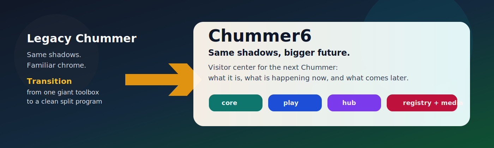
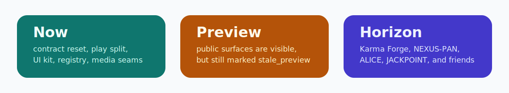
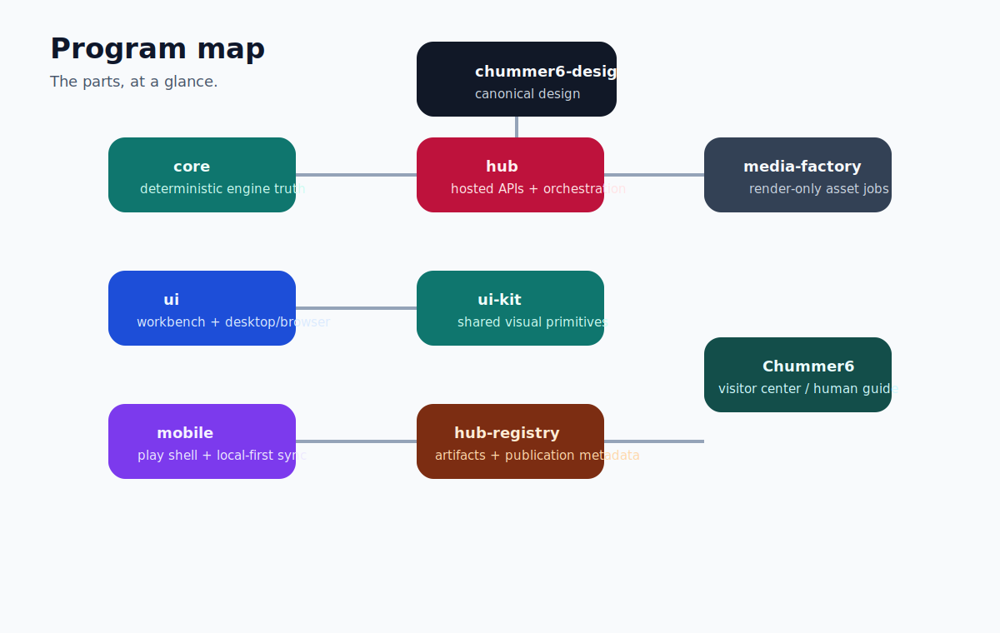

# Chummer6

> **Same shadows. Bigger future. Less confusion.**
>
> Chummer6 is the readable guide to the next Chummer: what it is becoming, how the parts fit together, what is happening right now, and which wild future ideas are still parked in the garage.

No, this is not the code repo.  
No, you do not need a flowchart and three espressos to understand the program.  
That is the whole reason this repo exists.

## Pick your path

- **I’m new here:** [Start Here](START_HERE.md)
- **Give me the two-minute version:** [What Chummer6 is](WHAT_CHUMMER6_IS.md)
- **What is happening right now?** [Current status](NOW/current-status.md)
- **How do the parts fit together?** [Program map](PARTS/README.md)
- **What are the future rabbit holes?** [Horizons](HORIZONS/README.md)
- **Where does the real design truth live?** [Where the real truth lives](WHERE_THE_REAL_TRUTH_LIVES.md)

## What Chummer6 is

Chummer6 is the visitor center for the next Chummer.

It explains the split in plain language, gives you the lay of the land, and helps you follow progress without needing to camp inside every repo and every Fleet view.

Think of it like this:

- `chummer6-design` is the architect’s office
- Fleet is mission control
- the code repos are the workshops
- **Chummer6 is the map on the wall**

## What’s happening now

Right now the team is doing foundation work, not bolting neon spoilers onto half-built engines.

Current focus:
- clean up the contract plane
- finish the play/session boundary
- make the shared UI kit real
- finish registry and media splits
- keep preview surfaces honestly labeled until they become the real thing

Read more: [Current phase](NOW/current-phase.md)

## Meet the parts

| Part | What it does | Read more |
| --- | --- | --- |
| Core | The deterministic rules engine | [core](PARTS/core.md) |
| Presentation | The workbench and big-screen UX | [presentation](PARTS/presentation.md) |
| Play | The player/GM shell for sessions and mobile use | [play](PARTS/play.md) |
| Run services | The hosted API and orchestration layer | [run-services](PARTS/run-services.md) |
| UI kit | Shared components, themes, and visual primitives | [ui-kit](PARTS/ui-kit.md) |
| Hub registry | Artifacts, publication, installs, compatibility | [hub-registry](PARTS/hub-registry.md) |
| Media factory | Render jobs, previews, and asset lifecycle | [media-factory](PARTS/media-factory.md) |
| Design | Canonical design front door | [design](PARTS/design.md) |
| Fleet | Mission control and operator truth | [fleet](PARTS/fleet.md) |

## Horizon ideas

Some ideas are too fun not to write down.  
They are real possibilities, but they are **not active build commitments**.

- [Karma Forge](HORIZONS/karma-forge.md) — personalized rule stacks without fork chaos
- [NEXUS-PAN](HORIZONS/nexus-pan.md) — a live synced table instead of isolated character files
- [ALICE](HORIZONS/alice.md) — stress-test a build before the run
- [JACKPOINT](HORIZONS/jackpoint.md) — turn grounded data into dossiers and briefings
- [GHOSTWIRE](HORIZONS/ghostwire.md) — replay a run like a forensic sim
- [RULE X-RAY](HORIZONS/rule-x-ray.md) — click any number and see where it came from

See all: [Horizon index](HORIZONS/README.md)

## Where the real decisions live

Chummer6 explains. It does not decide.

- Canonical design lives in `chummer6-design`
- Operational truth lives in Fleet
- Implementation lives in the owning code repos

---

_Last synced: 2026-03-11_  
_Derived from: chummer6-design, Fleet state, owning repo READMEs_  
_Canonical source: chummer6-design_
