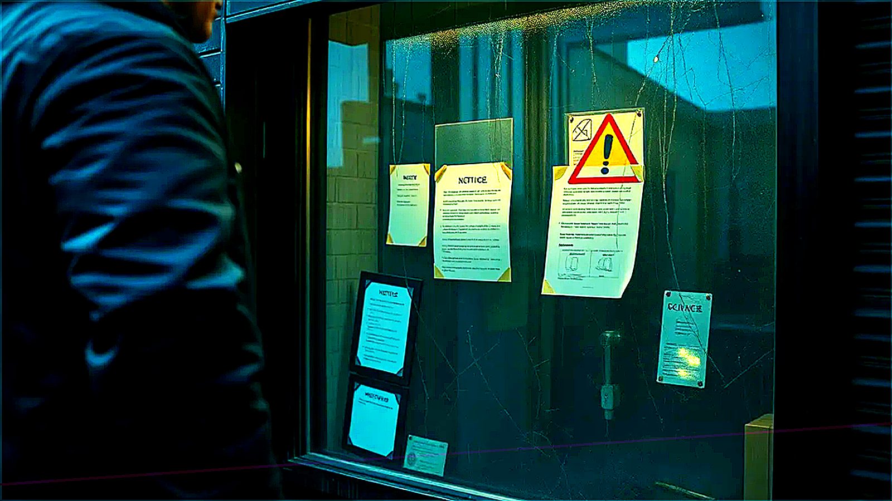

# Chummer6

> **Shadowrun tooling that shows its work.**
>
> Chummer6 is a flagship Shadowrun companion focused on inspectable rulings and trust under pressure.

Build a runner, check a ruling, and keep the session moving without a folklore argument in the middle of the run.

## Start here

- **New here:** [Start Here](START_HERE.md)
- **What is Chummer6?** [What Chummer6 is](WHAT_CHUMMER6_IS.md)
- **What works today?** [Current status](NOW/current-status.md)
- **Download a preview build:** [Download builds](DOWNLOAD.md)
- **See future ideas:** [Horizons](HORIZONS/README.md)
- **See the parts guide:** [PARTS/README.md](PARTS/README.md)
- **Help or feedback:** [How can I help?](HOW_CAN_I_HELP.md)
- **Read deeper design notes:** [Where to go deeper](WHERE_TO_GO_DEEPER.md)

## What is real today

- The guide and current status pages are the safest front door.
- Windows preview builds exist today when the download page lists them.
- The most concrete value right now is inspectable rules reasoning and visible proof surfaces.
- Linux and macOS are not public unless the download page says otherwise.
- Installer, update, and support polish are still catching up.

If you are coming from older Chummer habits, read the product story and current status before deciding whether the current preview fits your table.

 _[a streetdoc fitting a new cyberarm while the table asks whether the proof holds.](assets/hero/chummer6-hero.png)_

## What this means at a real table

> **GM** 
> "Rain, noise, and recoil all apply here."

> **Player** 
> "Then why did my pool drop to 9?"

> **Chummer6** 
> "Base 11. Rain -1. Wounds -1. Recoil -1. Final 9."

The project favors visible reasoning over trust-me table lore. Use the guide, current status, horizons, and proof surfaces to evaluate where it is strong today and where it is still tightening.

## Why this is worth watching

If you care about receipts, future session resilience, and tools that earn trust in public, this is the campaign OS worth watching.

- a clearer trust path for rulings tools
- less trust-me math through visible receipts
- a saner long-range path from prep to live play

If that sounds like your kind of software, the next stop is [What Chummer6 is](WHAT_CHUMMER6_IS.md).

## How can I help?

If you want to do more than watch, start with [How can I help?](HOW_CAN_I_HELP.md).

The short version: public bugs and feature ideas still go through the [Chummer6 issue tracker](https://github.com/ArchonMegalon/Chummer6/issues), and the guided contribution path is only for people who explicitly want a more hands-on, review-bound lane.

- [Open the public participation page](https://chummer.run/participate)

## Try it now

- [Check the current downloads](DOWNLOAD.md)
- Use the download page to see which file is recommended first and which platforms are not public yet.
- If you want the raw tag history anyway, [GitHub releases](https://github.com/ArchonMegalon/Chummer6/releases).

## What is happening right now

Right now the project is doing trust work before promising more than the preview can carry.
the guide must stay precise about current boundaries without downplaying the product

Current focus:
- honest public trust surfaces with explicit boundaries
- future lanes framed as concrete table upgrades
- inspectable evidence instead of vague claims
- keep public previews honestly labeled until they become the real thing

- [Current phase](NOW/current-phase.md)
- [Current status](NOW/current-status.md)
- [Public surfaces](NOW/public-surfaces.md)

## When you want the map

You do not need the program map first, but it is here when you need it:

- **Rules receipts** live in [Core](PARTS/core.md)
- **Prep and inspect** lives in [UI](PARTS/ui.md)
- **Table play** lives in [Mobile](PARTS/mobile.md)
- **Online coordination** lives in [Hub](PARTS/hub.md)
- **Shared chrome** lives in [UI Kit](PARTS/ui-kit.md)
- **Artifacts and compatibility** live in [Hub Registry](PARTS/hub-registry.md)
- **Render jobs** live in [Media Factory](PARTS/media-factory.md)
- **Long-range plan** lives in [Design](PARTS/design.md)

If you want the full guided version, read the [Program map](PARTS/README.md).

## Future ideas

Horizons are future campaign-OS lanes: vivid table problems, clear boundaries, and no fake shipping promises.

- [Horizons index](HORIZONS/README.md)

## Preview builds

 _[a quarantined proof shelf showing what must be checked before it reaches a table.](assets/hero/preview-warning.png)_

Want to know whether any of this exists as software yet? Start with the current preview builds.

- [Download builds](DOWNLOAD.md)
- [Raw GitHub releases](https://github.com/ArchonMegalon/Chummer6/releases)

> **Preview warning:** these builds are for curious testers, not cautious production use. 
> They may be unstable, unfinished, or awkward to install. 
> Install at your own risk.

The binaries are built from the working Chummer6 application, not from this orientation guide.

Need the long-range plan after that? [Where to go deeper](WHERE_TO_GO_DEEPER.md).
